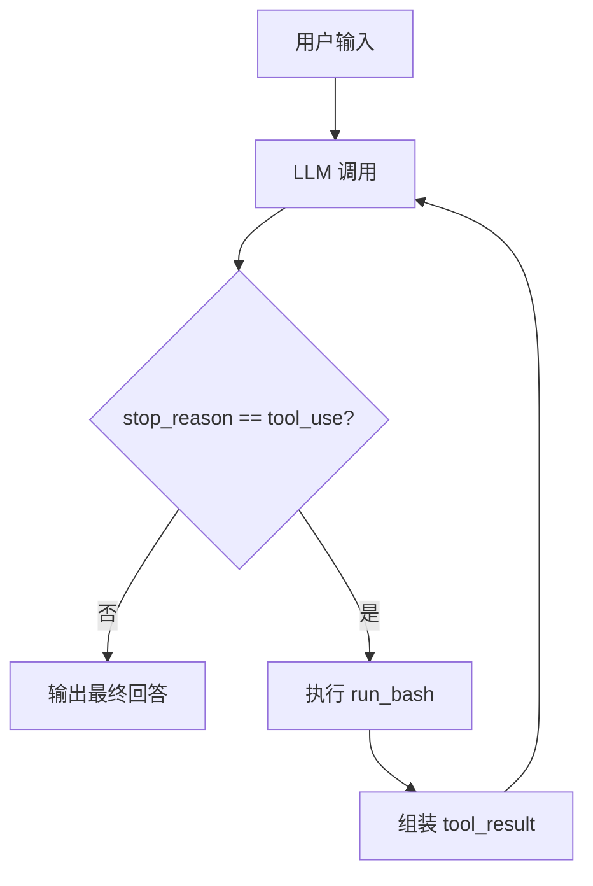

# 第 1 课：Agent Loop

## 2. 这一课要解决什么问题

这一课真正要解决的是：怎样把一个只会“回答问题”的 LLM，变成一个会连续行动的 agent。

如果没有这个机制，模型只能做一次性文本输出：

- 它可以说“我建议你运行 `ls`”。
- 但它不能真的运行 `ls`。
- 更关键的是，它也拿不到命令执行后的结果，自然不能根据真实世界反馈继续下一步。

也就是说，没有 agent loop，模型和环境之间只有单向说话，没有闭环。

## 3. 这一课新增了什么能力

相对“纯聊天模型”，这一课新增了两样最核心的能力：

- 一个可被模型调用的工具：`bash`
- 一个持续回灌工具结果的循环：`agent_loop()`

它不是“先让模型想完所有步骤再执行”，而是让模型边看结果边决定下一步。

## 4. 核心实现思路（必须通俗、易懂）

这节课的思路非常朴素，但几乎决定了后面 11 课的形状。

可以把系统拆成三层：

1. 模型层
   负责决定“现在要不要调用工具，如果调用，调用哪个工具、传什么参数”。
2. harness 层
   负责接住模型发出的 `tool_use` 请求，执行本地函数，再把结果包装回去。
3. 真实环境层
   这里的环境就是 shell。`run_bash()` 用 `subprocess.run()` 真正执行命令。

关键不是“调用了一次工具”，而是“把结果回灌给模型，然后继续循环，直到模型自己停下来”。

源码里最关键的一步不是 `run_bash()`，而是这条闭环：

```python
assistant(tool_use) -> harness执行 -> user(tool_result) -> assistant继续推理
```

只要这个闭环成立，后面无论加 todo、子代理、技能、后台任务，本质上都是在这个循环外面加新的状态和新的工具。

## 5. 关键执行流程（最好有步骤图/伪流程）

### 运行时步骤

1. 用户输入一段任务描述。
2. `agent_loop(messages)` 调用 `client.messages.create(...)`。
3. 模型返回一组 content block，里面可能包含文本，也可能包含 `tool_use`。
4. harness 把 assistant 原始输出先写进 `messages`。
5. 如果 `stop_reason != "tool_use"`，说明模型决定停止，本轮结束。
6. 如果有 `tool_use`，就逐个执行对应工具。
7. harness 把执行结果包装成 `tool_result`，作为一条新的 `user` 消息写回 `messages`。
8. 下一轮继续调用模型。
9. 重复这个过程，直到模型不再请求工具。

### 伪流程

```text
用户输入
  -> 调模型
  -> 模型要工具？
     -> 否：结束
     -> 是：执行工具
           -> 结果写回 messages
           -> 再调模型
```

### Mermaid 流程图



## 6. 源码中的关键实现细节

### 关键类 / 关键函数 / 关键数据结构

- `SYSTEM`
  系统提示词把当前工作目录注入给模型，告诉它自己身处哪个工作区。
- `TOOLS`
  这里只有一个工具声明：`bash`。这是一份给模型看的协议，不是实际执行逻辑。
- `run_bash(command: str) -> str`
  真正执行 shell 命令，并返回文本输出。
- `agent_loop(messages: list)`
  整个 agent 内核。
- `history`
  REPL 外层维护的对话历史，跨多轮用户输入共享。

### 代码里到底怎么做的

#### 1. 工具协议和工具实现是分开的

`TOOLS` 里声明的是：

- 工具名叫 `bash`
- 输入字段只有 `command`

真正执行是在 `run_bash()` 里完成的。这个分离非常重要，因为后面 `s02` 就是在不改循环的前提下扩展 `TOOLS` 和 handler。

#### 2. `run_bash()` 做了最小但很典型的 harness 防护

`run_bash()` 里有几个值得注意的点：

- 用黑名单挡住明显危险命令，比如 `rm -rf /`、`shutdown`
- `cwd=os.getcwd()`，保证命令在当前工作区执行
- `capture_output=True`，把 stdout/stderr 收回来
- `timeout=120`，避免命令无限卡住
- 输出最多保留 `50000` 字符，避免上下文被日志撑爆

这不是生产级沙箱，但已经说明了 harness 的职责：不是替模型思考，而是给模型一个受约束、可回收结果的执行环境。

#### 3. assistant 输出先入历史，再决定是否执行工具

在 `agent_loop()` 里，顺序是：

```python
messages.append({"role": "assistant", "content": response.content})
if response.stop_reason != "tool_use":
    return
```

这很重要，因为它保留了模型当时到底说了什么、请求了什么工具。后面很多课都会沿用这个顺序。

#### 4. `tool_result` 不是日志，而是下一轮模型输入

这一课最关键的数据结构是：

```python
{"type": "tool_result", "tool_use_id": block.id, "content": output}
```

其中：

- `tool_use_id` 用来把结果精确对应回某个 `tool_use`
- `content` 是工具输出

而这组结果会被包装成一条新的 `user` 消息。这一步决定了模型不是“看见控制台输出”，而是“在协议层接收到工具结果”。

## 7. 一个最小执行示例

假设用户输入：

```text
列出当前目录里的文件
```

可能发生的调用链是：

1. `history.append({"role": "user", "content": "列出当前目录里的文件"})`
2. `agent_loop(history)` 发起第一次模型调用
3. 模型返回一个 `tool_use`，例如请求：

```json
{
  "name": "bash",
  "input": {"command": "ls"}
}
```

4. harness 执行 `run_bash("ls")`
5. 命令输出被封装为：

```json
{
  "type": "tool_result",
  "tool_use_id": "...",
  "content": "README.md\nagents\ndocs\n..."
}
```

6. 这条 `tool_result` 被作为新的 `user` 消息回灌给模型
7. 模型看到真实结果后，给出最终文本回答
8. `stop_reason != "tool_use"`，循环结束

这里最值得注意的是：模型不是一次就知道答案，而是先行动，再基于结果作答。

## 8. 这一课相对上一课的升级点

这是起点课，没有上一课可比较。

如果一定要说“升级点”，那就是它把“聊天”升级成了“闭环执行”：

- 之前：用户 -> 模型 -> 文本结束
- 现在：用户 -> 模型 -> 工具 -> 结果 -> 模型 -> 工具/结束

同时，它也为下一课铺好了最重要的地基：只要循环不变，工具就可以不断扩展。

## 9. 这一课的局限与工程启发

### 局限

- 只有一个 `bash` 工具，能力极粗。
- `shell=True` 很方便，但安全边界很弱。
- 危险命令防护只是字符串黑名单。
- 没有文件读写的结构化工具，模型只能靠 shell 读文件。
- 没有路径约束、没有权限模型、没有状态持久化。

### 工程启发

- 真实 agent 的最小内核并不复杂，复杂的是外侧 harness。
- 一旦 `tool_use -> tool_result -> next turn` 这个协议成立，后续能力几乎都可以作为外挂加上去。
- 所以后面所有课都不是在推翻这一课，而是在保护、扩展、约束这个循环。

## 10. 一句话总结

一个真正能行动的 agent，最小内核不是“更聪明的 prompt”，而是“模型请求工具、harness 执行并回灌结果”的闭环循环。
