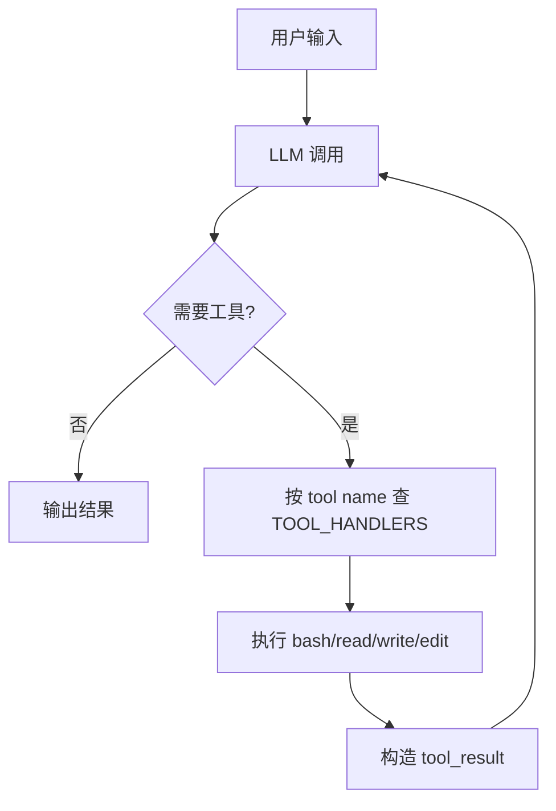

# 第 2 课：Tool Use

## 2. 这一课要解决什么问题

`s01` 已经让模型能调用一个工具，但那还远远不够。

如果只有 `bash`：

- 读文件要靠 shell 拼命令，结果不稳定。
- 写文件也要靠 shell 重定向，风险大而且难校验。
- 编辑文件只能让模型自己拼 `sed` 或其他命令，失败率高。

更大的问题是：如果每加一个工具都要改主循环，系统会很快失控。真正要解决的不是“工具太少”，而是“如何让加工具这件事本身可扩展”。

## 3. 这一课新增了什么能力

相对上一课，这一课新增了两层能力：

- 能力层面：从单一 `bash` 扩展到 `read_file`、`write_file`、`edit_file`
- 架构层面：引入 `TOOL_HANDLERS` 分发表，让工具扩展不需要改 `agent_loop()`

这节课真正的升级不是多了三个工具，而是工具系统从“写死的单工具调用”变成了“协议声明 + handler 分发”。

## 4. 核心实现思路（必须通俗、易懂）

这一课的思路可以概括成一句话：

把“模型能看到什么工具”与“本地怎么执行工具”拆开。

系统分成三层：

1. 工具协议层
   由 `TOOLS` 定义。告诉模型有哪些工具、每个工具叫什么、入参长什么样。
2. 工具执行层
   由 `run_read()`、`run_write()`、`run_edit()` 等函数实现。
3. 分发层
   由 `TOOL_HANDLERS` 把工具名映射到具体函数。

这样做的好处是：

- 主循环不关心工具细节
- 新工具只要补 schema 和 handler
- 不同工具可以有各自的安全策略和参数适配逻辑

源码里最关键的一步不是多写了 `run_read()`，而是把“工具名到函数”的对应关系集中到了 `TOOL_HANDLERS`。

## 5. 关键执行流程（最好有步骤图/伪流程）

### 运行时步骤

1. 用户提出任务，例如“读取某个文件并修改一段文本”。
2. `agent_loop()` 调用模型，带上 `TOOLS` 中定义的多工具协议。
3. 模型返回 `tool_use`，例如 `read_file` 或 `edit_file`。
4. harness 根据 `block.name` 去 `TOOL_HANDLERS` 查找对应 handler。
5. handler 调用具体执行函数。
6. 返回值被包装成 `tool_result`。
7. 结果回灌给模型，模型继续决定下一步。

### 伪流程

```text
LLM 返回 tool_use(name, input)
  -> TOOL_HANDLERS[name]
  -> 对应本地函数
  -> tool_result
  -> 再次调用 LLM
```

### Mermaid 流程图



## 6. 源码中的关键实现细节

### 关键类 / 关键函数 / 关键数据结构

- `safe_path(p: str) -> Path`
- `run_bash()`
- `run_read()`
- `run_write()`
- `run_edit()`
- `TOOL_HANDLERS`
- `TOOLS`
- `agent_loop()`

### 代码里到底怎么做的

#### 1. `safe_path()` 让文件工具有了最小工作区边界

```python
path = (WORKDIR / p).resolve()
if not path.is_relative_to(WORKDIR):
    raise ValueError(...)
```

它解决的是路径穿越问题。比如模型如果尝试读 `../../secret.txt`，`safe_path()` 会阻止它逃出工作区。

这一步很重要，因为从这一课开始，agent 不只是“执行命令”，而是“开始直接接触文件系统”。

#### 2. 文件工具是结构化的，不再依赖 shell 拼字符串

`run_read()`、`run_write()`、`run_edit()` 都是普通 Python 函数：

- `run_read()` 按行读取，可选 `limit`
- `run_write()` 自动创建父目录
- `run_edit()` 只替换第一次出现的 `old_text`

这里的重点不是功能多高级，而是“行为边界更清楚”。模型不必再用复杂 shell 技巧拼读写逻辑，成功率会高很多。

#### 3. `TOOL_HANDLERS` 做了参数适配

```python
TOOL_HANDLERS = {
    "bash": lambda **kw: run_bash(kw["command"]),
    "read_file": lambda **kw: run_read(kw["path"], kw.get("limit")),
    ...
}
```

这里用 `lambda **kw` 有两个现实意义：

- 所有 handler 入口统一成“接收模型给出的 JSON 入参”
- 可以很轻松地把工具 schema 字段映射到真实函数签名

这其实就是最小版的工具运行时。

#### 4. `agent_loop()` 几乎没变

这一课最值得记住的一点是：`agent_loop()` 的结构和 `s01` 几乎一样。

它仍然是：

1. 调模型
2. 写入 assistant 消息
3. 判断是否 `tool_use`
4. 执行工具
5. 组装 `tool_result`
6. 回灌给模型

变化主要发生在：

- `tools=TOOLS` 现在变成多工具集合
- 工具执行不再写死为 `run_bash()`，而是通过 `TOOL_HANDLERS.get(block.name)` 分发

这说明系统真的具备了“工具扩展不改循环”的架构稳定性。

## 7. 一个最小执行示例

假设用户输入：

```text
读取 README-zh.md 的前 20 行，然后把结果写到 notes/intro.txt
```

一个典型调用链可能是：

1. 模型先调用：

```json
{"name": "read_file", "input": {"path": "README-zh.md", "limit": 20}}
```

2. harness 在 `TOOL_HANDLERS` 中查到 `read_file`
3. `run_read("README-zh.md", 20)` 返回前 20 行文本
4. 结果回灌给模型
5. 模型接着调用：

```json
{
  "name": "write_file",
  "input": {
    "path": "notes/intro.txt",
    "content": "..."
  }
}
```

6. `run_write()` 自动创建 `notes/` 目录并写文件
7. 返回 `Wrote ... bytes to notes/intro.txt`
8. 模型拿到成功结果后结束

这整个过程中，主循环没有因为“读文件”和“写文件”而改变结构。

## 8. 这一课相对上一课的升级点

### 上一课做不到什么

`s01` 只有一个 `bash` 工具，模型虽然能行动，但动作太粗：

- 读写文件不稳定
- 没有路径安全边界
- 工具一多，主循环很容易被写乱

### 这一课怎么补上

`s02` 的补法很工程化：

- 用 JSON schema 把工具协议写清楚
- 用 `TOOL_HANDLERS` 集中做分发
- 用结构化文件工具替代一部分 shell 操作

### 代码结构上新增了哪些模块或职责

- 新增 `safe_path()` 负责工作区边界
- 新增 `run_read()`、`run_write()`、`run_edit()` 负责文件操作
- 新增 `TOOL_HANDLERS` 负责工具名到函数的映射

最大的变化不是多了几个函数，而是循环外面长出了“工具运行时”。

## 9. 这一课的局限与工程启发

### 局限

- `edit_file` 只支持精确字符串替换，不支持 patch 语义。
- `safe_path()` 只保护文件工具，不保护 `bash`。
- `write_text()` 默认文本模式，没处理编码和二进制文件。
- `lambda **kw` 足够教学，但缺乏更明确的类型层。

### 工程启发

- 主循环要尽量稳定，变化应该外移到工具层。
- 工具协议和本地实现解耦，是 agent harness 的第一层可扩展性。
- 工具分发一旦稳定下来，后面加 todo、task、background、worktree 都可以复用同一套路。

## 10. 一句话总结

这节课真正教会你的不是“多几个工具”，而是“让工具增长时，主循环还能保持不变”。
