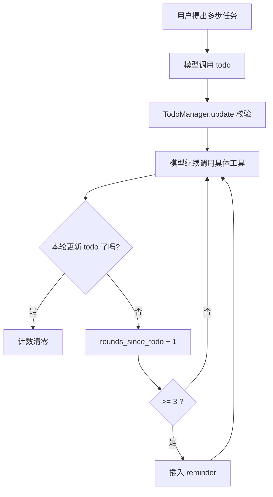

# 第 3 课：TodoWrite

## 2. 这一课要解决什么问题

前两课已经让 agent 会行动，但还不会稳定地推进多步任务。

如果没有这节课的机制，agent 很容易出现这几种问题：

- 刚看完目录就忘了自己原来要改什么
- 做到一半跳去做别的事
- 已经完成了哪些步骤，模型自己也说不清
- 用户也看不到它当前打算怎么推进

一句话概括：没有显式计划状态，agent 会漂。

## 3. 这一课新增了什么能力

相对上一课，这一课新增了一个“可被模型自己写入的计划状态槽位”：

- `todo` 工具
- `TodoManager`
- “连续 3 轮不更新 todo 就提醒”的 nag 机制

这里不是引入一个传统 workflow engine，而是让模型自己维护任务列表，harness 负责校验和提醒。

## 4. 核心实现思路（必须通俗、易懂）

这一课的核心设计很值得注意：不是 harness 自己规划，而是 harness 提供一个结构化的“计划白板”，让模型自己写。

系统分成三层：

1. 模型
   决定当前有哪些任务、哪个任务在进行中、哪个任务已经完成。
2. `TodoManager`
   负责校验 todo 列表是否合法，并把它渲染成稳定可读的文本。
3. nag 机制
   如果模型连续几轮不更新 todo，harness 会插入 `<reminder>` 提醒它回来维护计划。

这其实是在把“计划内容”和“计划纪律”解耦：

- 计划内容由模型决定
- 计划纪律由 harness 兜底

源码里最关键的一步不是 `TodoManager.render()`，而是 `agent_loop()` 里对 `rounds_since_todo` 的维护。因为真正让 todo 持续发挥作用的，不是状态本身，而是“你不能一直忘了它”。

## 5. 关键执行流程（最好有步骤图/伪流程）

### 运行时步骤

1. 用户给出一个多步任务。
2. 模型先调用 `todo` 工具，写入当前任务列表。
3. `TodoManager.update()` 校验每项任务是否合法。
4. harness 把渲染后的 todo 文本回灌给模型。
5. 模型再去调用 `read_file`、`edit_file`、`write_file` 等具体工具。
6. 如果这一轮没有用 `todo`，`rounds_since_todo += 1`。
7. 连续 3 轮未更新时，harness 在下一轮 `user` 内容前插入：

```text
<reminder>Update your todos.</reminder>
```

8. 模型被拉回计划视角，继续更新 todo。

### Mermaid 流程图



## 6. 源码中的关键实现细节

### 关键类 / 关键函数 / 关键数据结构

- `TodoManager`
- `TodoManager.update(items)`
- `TodoManager.render()`
- `TODO = TodoManager()`
- `TOOL_HANDLERS["todo"]`
- `agent_loop(messages)`
- `rounds_since_todo`
- `used_todo`

### 代码里到底怎么做的

#### 1. todo 是结构化状态，不是自由文本

`todo` 工具的 schema 约束每一项都包含：

- `id`
- `text`
- `status`

其中 `status` 只能是：

- `pending`
- `in_progress`
- `completed`

这意味着模型不是随便“说说计划”，而是必须把计划写进一个小状态机里。

#### 2. `TodoManager.update()` 在做 harness 级校验

这个函数有几个关键约束：

- 最多 20 个 todo
- `text` 不能为空
- 状态必须合法
- 同一时间只能有一个 `in_progress`

这里非常能体现 harness 思维：

- 模型决定内容
- harness 保证状态形状可控

如果没有这一层，模型很容易生成两个同时进行中的任务，或者输出半残数据。

#### 3. `render()` 负责把内部状态变成稳定可读界面

`render()` 会把状态渲染成：

- `[ ]` 表示待办
- `[>]` 表示进行中
- `[√]` 表示完成

同时追加：

```text
(2/5 completed)
```

这让模型和用户都能看到同一个进度视图。

#### 4. nag reminder 是插在工具结果里的

在 `agent_loop()` 里：

- 本轮用了 `todo`，就 `used_todo = True`
- 否则 `rounds_since_todo += 1`
- 如果达到阈值，就在 `results` 前面插入一段普通文本块

这一步很巧妙：

- 它没有强制模型必须先规划
- 也没有单独打断主循环
- 它只是把提醒作为下一轮上下文的一部分塞进去

这是典型的 harness 做法：轻推，不硬控。

## 7. 一个最小执行示例

假设用户输入：

```text
为一个小脚本加日志、补 README、再检查一遍输出
```

一个典型过程可能是：

1. 模型先调用 `todo`：

```json
{
  "items": [
    {"id": "1", "text": "阅读现有脚本", "status": "completed"},
    {"id": "2", "text": "加入日志输出", "status": "in_progress"},
    {"id": "3", "text": "补充 README 说明", "status": "pending"},
    {"id": "4", "text": "运行并检查输出", "status": "pending"}
  ]
}
```

2. `TodoManager.update()` 校验通过，返回渲染文本
3. 模型接着调用 `read_file`、`edit_file`
4. 连续几轮它都只顾着编辑文件，忘了更新 todo
5. `rounds_since_todo` 达到 3，harness 插入：

```text
<reminder>Update your todos.</reminder>
```

6. 模型下一轮又调用 `todo`，把“加入日志输出”标为 `completed`，把“补充 README 说明”切成 `in_progress`

这个例子说明：todo 真正起作用的地方，不是第一次写，而是后续持续更新。

## 8. 这一课相对上一课的升级点

### 上一课做不到什么

`s02` 里的 agent 已经能读写文件，但它只是“会做动作”，还没有稳定的任务推进结构。

它缺的是：

- 当前正在做什么
- 后面还剩什么
- 哪一步已经完成

### 这一课怎么补上

`s03` 引入的是“外部可写状态”：

- 不是让模型把计划写在普通文本里
- 而是让它通过 `todo` 工具写入一个受校验的状态表

### 代码结构上新增了哪些模块或职责

- 新增 `TodoManager` 负责计划状态
- 新增 `todo` 工具定义和 handler
- 在 `agent_loop()` 中新增 reminder 注入逻辑

相对上一课，这一课最大的变化不是多了一个工具，而是主循环开始管理“模型的执行纪律”。

## 9. 这一课的局限与工程启发

### 局限

- todo 只存在内存里，程序退出就没了。
- 没有依赖关系，无法表达“任务 B 等任务 A 完成”。
- 只能有一个 `in_progress`，对并行任务支持弱。
- 计划完全由模型填写，质量仍然不稳定。

### 工程启发

- 计划不一定要由 harness 生成，但要由 harness 约束。
- “提醒机制”很重要，很多 agent 失败不是不会做，而是做着做着忘了维护状态。
- 这一课是后面 `s07` 任务系统的前身：先让模型习惯写状态，再把状态搬出对话。

## 10. 一句话总结

这一课让 agent 第一次不只是“会做事”，而是“知道自己正在做哪一步，并且被 harness 逼着别忘了更新进度”。
