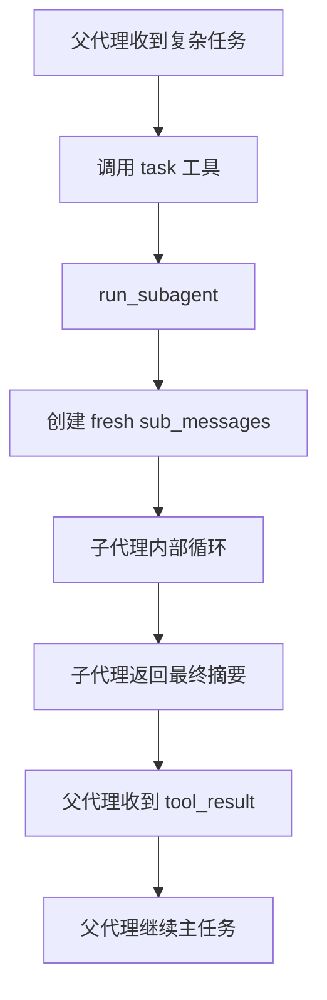

# 第 4 课：Subagent

## 2. 这一课要解决什么问题

到了 `s03`，agent 已经会规划，但还有一个明显问题：所有事情都挤在同一段 `messages[]` 里。

如果没有这个机制，复杂任务会出现几种典型失控：

- 为了探索一个支线问题，主对话被塞满无关细节
- 读了大量文件后，主线程上下文越来越脏
- 一个子问题的失败尝试会污染后续主任务的决策
- 用户最终只需要一个结论，但模型却把整个探索过程都带在身上

所以这一课要解决的不是“如何并发”，而是“如何给子任务一个干净上下文”。

## 3. 这一课新增了什么能力

相对上一课，这一课新增的是：

- `task` 工具
- `run_subagent(prompt)` 子代理执行函数
- 父代理与子代理的双工具集设计：`PARENT_TOOLS` / `CHILD_TOOLS`

新能力可以概括为一句话：父代理可以把一个子任务交给一个从空白 `messages=[]` 开始的子代理，并且只拿回摘要，不把中间过程带回主上下文。

## 4. 核心实现思路（必须通俗、易懂）

这节课真正做的事情，其实是在把“文件系统共享”和“会话上下文隔离”拆开。

设计上有两条很重要的线：

- 子代理和父代理共享同一个工作目录，所以它们看到的是同一个文件系统世界
- 但子代理有一份全新的 `sub_messages`，不继承父代理已经积累的大段历史

也就是说：

- 共享环境
- 隔离上下文

这是非常实用的工程思路。很多时候你不需要把执行环境复制一份，只要把思考上下文隔开，就已经能大幅降低主线程污染。

源码里最关键的一步不是 `task` 工具声明，而是 `run_subagent()` 里这句：

```python
sub_messages = [{"role": "user", "content": prompt}]
```

它意味着子代理是从一张白纸开始做事的。

## 5. 关键执行流程（最好有步骤图/伪流程）

### 运行时步骤

1. 用户给父代理一个复杂任务。
2. 父代理判断其中某个子问题适合拆出去，于是调用 `task` 工具。
3. harness 进入 `run_subagent(prompt)`。
4. 子代理创建一份全新的 `sub_messages`，只放子任务 prompt。
5. 子代理用自己的 `SUBAGENT_SYSTEM` 和 `CHILD_TOOLS` 运行一个内部 agent loop。
6. 子代理可能读文件、跑命令、写文件。
7. 当子代理不再请求工具时，harness 只提取它最后一轮文本摘要。
8. 父代理把这段摘要作为 `tool_result` 接收回来。
9. 父代理继续基于摘要决定下一步。

### Mermaid 流程图



## 6. 源码中的关键实现细节

### 关键类 / 关键函数 / 关键数据结构

- `SYSTEM`
- `SUBAGENT_SYSTEM`
- `CHILD_TOOLS`
- `PARENT_TOOLS`
- `run_subagent(prompt)`
- `TOOL_HANDLERS`
- `agent_loop(messages)`

### 代码里到底怎么做的

#### 1. 子代理没有继承父代理的 `messages`

`run_subagent()` 一开始就新建：

```python
sub_messages = [{"role": "user", "content": prompt}]
```

这就是整个机制的核心。子代理不会看到父代理之前的探索噪声，也不会把自己的中间推理步骤回写到父代理的上下文。

#### 2. 子代理工具集被刻意收窄

源码里有一句非常关键的注释：

```python
# Child gets all base tools except task (no recursive spawning)
```

也就是说：

- 子代理可以 `bash`、`read_file`、`write_file`、`edit_file`
- 但不能再继续调用 `task`

这一步是在防止递归派生子代理失控。教学版实现把递归链路主动砍断了。

#### 3. 父代理和子代理共享同一套本地工具实现

子代理执行工具时，仍然使用同一个 `TOOL_HANDLERS`。所以：

- 它们操作的是同一份工作区
- 只是会话上下文是分开的

这也说明这节课解决的是“思考隔离”，不是“资源隔离”。

#### 4. 父代理只接收摘要，不接收中间轨迹

`run_subagent()` 最终返回：

```python
"".join(b.text for b in response.content if hasattr(b, "text"))
```

也就是子代理最后一轮 assistant 输出中的文本块。

这意味着：

- 子代理中间经历了多少轮工具调用
- 看过多少文件
- 做过哪些失败尝试

这些都不会进入父代理主上下文。父代理只拿“结论”。

这一步非常值钱，因为它直接控制了主上下文的体积和纯度。

## 7. 一个最小执行示例

假设用户输入：

```text
帮我找出这个项目里任务系统相关的入口文件，然后告诉我应该先看哪里
```

一个可能的过程是：

1. 父代理认为“全仓库搜索任务系统入口”适合单独处理
2. 父代理调用：

```json
{
  "name": "task",
  "input": {
    "prompt": "Search the repository for task-system-related files and summarize the best entry points.",
    "description": "find task system entry points"
  }
}
```

3. harness 进入 `run_subagent()`
4. 子代理从空上下文开始，调用 `bash` 或 `read_file`
5. 子代理找到 `agents/s07_task_system.py`、`.tasks/` 相关入口
6. 子代理最后输出摘要，例如：

```text
Start with agents/s07_task_system.py. The core class is TaskManager...
```

7. 父代理收到这段摘要后，再决定是否深入阅读某个文件

这里的重点不是“子代理能搜索”，而是“搜索过程没有把主线程上下文弄脏”。

## 8. 这一课相对上一课的升级点

### 上一课做不到什么

`s03` 有计划，但所有执行和探索仍然在一个 `messages[]` 里完成。

这会导致：

- 规划信息和探索噪声混在一起
- 主上下文越来越肥
- 用户只想要一个摘要，但主线程却背着全部调查过程

### 这一课怎么补上

`s04` 的补法不是“再加一种计划状态”，而是“把子任务放到独立上下文里做”。

### 代码结构上新增了哪些模块或职责

- 新增 `SUBAGENT_SYSTEM`
- 新增 `CHILD_TOOLS`
- 新增 `run_subagent()`
- 新增父层 `task` 工具

同时必须明确一个源码事实：`s04` 并没有把 `s03` 的 `TodoManager` 一起保留下来。它是一个聚焦“上下文隔离”的教学切片，而不是 `s03` 的严格超集。

## 9. 这一课的局限与工程启发

### 局限

- 子代理共享同一文件系统，不是完全资源隔离。
- 子代理摘要可能丢失细节证据。
- 没有并行调度，一个 `task` 调用还是同步等待子代理跑完。
- 没有持久身份，子代理执行完就消失。

### 工程启发

- 复杂系统里，很多时候先做“上下文隔离”就已经很有效，不必一上来做进程隔离。
- 子任务只回摘要，是控制主上下文质量的常用手段。
- 这节课为后面的 `s09` 持久化队友做了概念铺垫：先有一次性子代理，再走向长期队友。

## 10. 一句话总结

这节课把“大任务拆出去做”真正落成了代码：共享文件系统，但不共享对话历史，主线程只收摘要，不收噪声。
