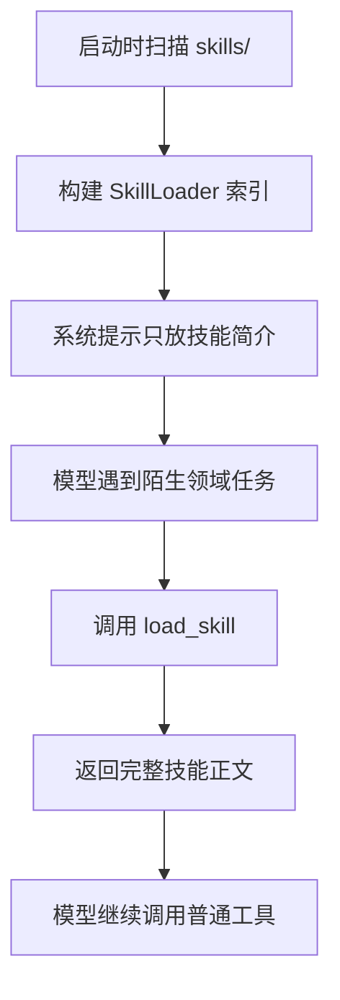

# 第 5 课：技能加载（Skill Loading）

## 2. 这一课要解决什么问题

到了 `s04`，agent 已经能拆子任务，但它仍然有一个很现实的问题：不知道的东西太多。

如果把所有领域知识都提前塞进 system prompt，会马上遇到几个问题：

- prompt 变得又长又贵
- 大部分知识这轮根本用不上
- 一次性塞进去的内容越多，模型越容易被噪声干扰
- 技能库一扩张，上下文马上爆炸

所以这一课真正要解决的是：知识必须能按需加载，而不是开机全灌。

## 3. 这一课新增了什么能力

相对上一课，这一课新增的是一套两层知识注入机制：

- 第一层：只把技能名和简介放进 `SYSTEM`
- 第二层：当模型主动调用 `load_skill(name)` 时，再把技能正文通过 `tool_result` 注入

新增的关键组件是：

- `SKILLS_DIR`
- `SkillLoader`
- `load_skill` 工具

## 4. 核心实现思路（必须通俗、易懂）

这节课的设计很像一个“知识目录 + 按需展开”的系统。

先不要把所有细节都告诉模型，而是先告诉它：

- 现在有哪些技能可用
- 每个技能大致能干什么

只有当模型自己判断“这事超出当前通用能力，需要某个专门技能”时，才调用 `load_skill` 把全文取回来。

这样就形成了两层结构：

### 第一层：便宜的技能目录

放在 `SYSTEM` 里，只包含：

- 技能名
- 描述
- 可选 tags

### 第二层：昂贵但必要的技能正文

通过 `load_skill` 调用后，返回：

```xml
<skill name="pdf">
...
</skill>
```

这样做的好处很直接：

- 系统提示保持轻量
- 技能正文只在真的需要时进入上下文
- 技能库可以不断变大，但每次会话只加载必要部分

源码里最关键的一步不是扫描 `skills/` 目录，而是“元信息常驻，正文延迟进入上下文”这条策略。

## 5. 关键执行流程（最好有步骤图/伪流程）

### 运行时步骤

1. 程序启动时，`SkillLoader` 扫描 `skills/**/SKILL.md`
2. 解析 frontmatter，建立技能索引
3. `SYSTEM` 只注入技能名称和简述
4. 用户提出一个带领域性的任务，例如处理 PDF
5. 模型看到 system prompt 中有 `pdf` 技能，于是调用 `load_skill("pdf")`
6. harness 返回该技能全文，用 `<skill name="...">` 包裹
7. 模型拿到技能正文后，再决定怎么调用普通工具完成任务

### Mermaid 流程图



## 6. 源码中的关键实现细节

### 关键类 / 关键函数 / 关键数据结构

- `SKILLS_DIR = WORKDIR / "skills"`
- `class SkillLoader`
- `SkillLoader._load_all()`
- `SkillLoader._parse_frontmatter()`
- `SkillLoader.get_descriptions()`
- `SkillLoader.get_content(name)`
- `SKILL_LOADER = SkillLoader(SKILLS_DIR)`
- `TOOL_HANDLERS["load_skill"]`

### 代码里到底怎么做的

#### 1. `SkillLoader` 启动时扫描技能文件

它会递归遍历：

```python
for f in sorted(self.skills_dir.rglob("SKILL.md"))
```

也就是说技能目录可以分层组织，不要求只有一层子目录。

#### 2. frontmatter 解析是简化版，不是完整 YAML

这里有一个很值得说明的源码事实：

`_parse_frontmatter()` 用的是正则和简单的 `key: value` 分割，不是完整 YAML parser。

这意味着它适合教学，也够用，但边界很明显：

- 简单字段没问题
- 复杂嵌套结构、转义、列表等 YAML 特性并没有完整支持

这也是教学版 harness 的典型特点：抓原理，不追满配实现。

#### 3. 第一层注入是 `get_descriptions()`

`SYSTEM` 中实际注入的是：

```python
Skills available:
  - pdf: ...
  - code-review: ...
```

不是全文，只是一个目录视图。

这让模型知道“仓库里有这些能力”，但不会立刻承担全文 token 成本。

#### 4. 第二层注入是 `get_content(name)`

当模型调用 `load_skill` 时，`SkillLoader.get_content()` 返回：

```python
<skill name="pdf">
...
</skill>
```

这个 XML 风格外壳的价值在于：

- 给正文一个清晰边界
- 帮助模型把这段内容识别为“技能说明块”，而不是普通自然语言聊天内容

#### 5. 真实技能文件不是示意，是运行时输入

仓库里真实存在：

- `skills/pdf/SKILL.md`
- `skills/code-review/SKILL.md`

例如 `pdf` 技能里写了：

- 如何用 `pdftotext`
- 如何用 `PyMuPDF`
- 如何合并、拆分 PDF

这说明 `s05` 不是纯概念课，它真的把外部知识源接进了运行时。

## 7. 一个最小执行示例

假设用户输入：

```text
帮我读取一个 PDF 并提取文字
```

一个可能的过程是：

1. 模型先看 `SYSTEM`
2. 它发现可用技能列表里有 `pdf`
3. 模型调用：

```json
{"name": "load_skill", "input": {"name": "pdf"}}
```

4. harness 返回：

```xml
<skill name="pdf">
# PDF Processing Skill
...
</skill>
```

5. 模型读完技能正文后，知道可以优先尝试 `pdftotext` 或 `PyMuPDF`
6. 接下来它再调用 `bash` 或其他工具去执行对应命令
7. 最终把提取结果返回给用户

真正重要的是：这份 PDF 处理知识不是一开始就塞进 system prompt 的，而是在确认需要之后才进入上下文。

## 8. 这一课相对上一课的升级点

### 上一课做不到什么

`s04` 能拆子任务，但“会不会做某个领域任务”依旧受限于通用模型知识。

它没有一个明确的“按需加载外部知识”的通道。

### 这一课怎么补上

`s05` 的补法不是让 prompt 更大，而是把知识变成一个可查询资源：

- 平时只告诉模型有哪些技能
- 真需要时再取正文

### 代码结构上新增了哪些模块或职责

- 新增 `SkillLoader`
- 新增技能目录扫描逻辑
- 新增 `load_skill` 工具
- `SYSTEM` 开始包含技能目录信息

同时要明确一个源码事实：`s05` 这个教学切片没有继续保留 `s04` 的 `task` 工具。它把焦点完全放到了知识注入，而不是子代理编排。

## 9. 这一课的局限与工程启发

### 局限

- frontmatter 解析能力很简化。
- 技能正文一旦加载，就直接进入当前上下文，没有更细的缓存或分页。
- 启动时仍要扫描整个 `skills/` 目录。
- 这里只有文本技能，没有把脚本、资源模板、引用关系真正做成运行时图谱。

### 工程启发

- 知识要分层：目录常驻，正文按需。
- 很多时候不需要更大的 system prompt，而需要更好的知识检索和注入时机。
- 这节课为后面的 `s06` 埋下了直接伏笔：既然知识会按需注入，那上下文迟早会变大，压缩机制就必须跟上。

## 10. 一句话总结

这节课把“知道很多”变成了“知道哪里能找到需要的知识，并在需要时再把它拉进来”。
