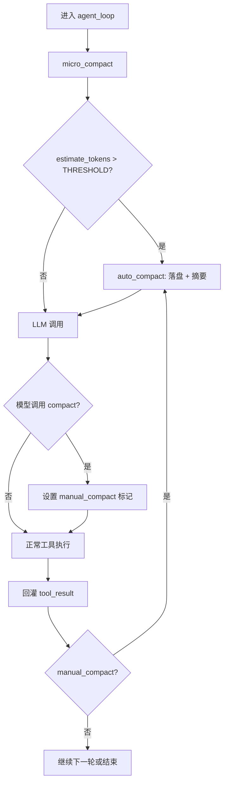

# 第 6 课：上下文压缩（Context Compact）

## 2. 这一课要解决什么问题

到了 `s05`，agent 已经能加载技能、读写文件、拆子任务，但上下文膨胀问题已经无法回避。

如果没有这一课的机制，agent 会卡在几个很现实的地方：

- 大量工具输出会把上下文挤满
- 技能正文和文件内容叠加后，token 很快爆掉
- 模型必须反复重新看长日志和旧结果，推理成本越来越高
- 一个长会话跑到后面，历史比当前任务本身还重

所以这一课要解决的是：不是“记住一切”，而是“有策略地忘掉不重要的细节，同时保留连续性”。

## 3. 这一课新增了什么能力

相对上一课，这一课新增了三层压缩能力：

- `micro_compact(messages)`
  每轮静默压缩老旧工具结果
- `auto_compact(messages)`
  当上下文估算超过阈值时，自动落盘全文并摘要重建会话
- `compact` 工具
  允许模型主动触发手动压缩

这节课新增的不是一个“记忆库”，而是一套上下文生命周期管理机制。

## 4. 核心实现思路（必须通俗、易懂）

这节课最重要的思想是：不要把“压缩”理解成一个单点动作，而要理解成分层治理。

源码里其实有三层：

### 第一层：微压缩

每次调用模型前都执行，成本低，动作轻：

- 扫描所有历史 `tool_result`
- 保留最近几条原文
- 把更早、且很长的结果替换成占位符，比如：

```text
[Previous: used read_file]
```

这一步不是为了彻底清空历史，而是先去掉最占空间、但对当前轮次价值最低的长输出。

### 第二层：自动压缩

如果粗略 token 估算超阈值：

- 先把完整会话落盘到 `.transcripts/`
- 再让模型自己把整段对话总结成一份 continuity summary
- 用两条新消息替换原来的整段 `messages`

也就是说，历史不是消失了，而是被“转储到磁盘 + 缩成摘要”。

### 第三层：手动压缩

模型也可以主动调用 `compact`。但源码里值得特别指出的一点是：

- `compact` 工具本身并不直接执行压缩
- 它只是返回 `"Manual compression requested."`
- 真正的压缩动作是在 `agent_loop()` 里通过 `manual_compact` 标记统一触发

这说明压缩控制权仍然在主循环，而不是散落在工具函数里。

## 5. 关键执行流程（最好有步骤图/伪流程）

### 运行时步骤

1. 每次进入 `agent_loop()` 顶部，先执行 `micro_compact(messages)`
2. 然后用 `estimate_tokens(messages)` 做粗略 token 估算
3. 如果超出 `THRESHOLD`，打印 `[auto_compact triggered]`
4. 调用 `auto_compact(messages)`：
   - 保存完整 transcript 到 `.transcripts/*.jsonl`
   - 请求模型摘要整段历史
   - 用压缩后的两条消息替换原历史
5. 然后正常发起 LLM 调用
6. 如果模型调用了 `compact` 工具，先返回一个普通 `tool_result`
7. 当前轮工具结果回灌后，再由 `manual_compact` 标记触发真正压缩

### Mermaid 流程图



## 6. 源码中的关键实现细节

### 关键类 / 关键函数 / 关键数据结构

- `THRESHOLD = 50000`
- `TRANSCRIPT_DIR = WORKDIR / ".transcripts"`
- `KEEP_RECENT = 3`
- `estimate_tokens(messages)`
- `micro_compact(messages)`
- `auto_compact(messages)`
- `TOOL_HANDLERS["compact"]`
- `manual_compact`

### 代码里到底怎么做的

#### 1. `estimate_tokens()` 是近似估算

```python
return len(str(messages)) // 4
```

这当然不精确，但对教学目的已经够了。这里的重点不是精确记账，而是“让主循环知道何时该压缩”。

#### 2. `micro_compact()` 不是删消息，而是替换旧结果内容

它会：

1. 扫描所有 `user` 消息里的 `tool_result`
2. 记录每个结果出现的位置
3. 再扫描 assistant 历史，建立 `tool_use_id -> tool_name` 映射
4. 对较老、较长的结果进行占位替换

最值得注意的是这个替换逻辑：

```python
result["content"] = f"[Previous: used {tool_name}]"
```

这不是一刀切清空，而是保留“当时调用过哪个工具”的轨迹信息。

#### 3. `auto_compact()` 会先落盘全文

在真正替换会话前，它先把全文写到：

```python
.transcripts/transcript_<timestamp>.jsonl
```

这是一个很重要的工程习惯：

- 先保留可追溯原始材料
- 再做摘要和清理

否则一旦压缩摘要漏了信息，原始上下文就彻底丢了。

#### 4. 自动压缩后，历史被重建成两条消息

`auto_compact()` 最终返回：

- 一条 `user` 消息，包含 transcript 路径和摘要
- 一条 `assistant` 消息，表示“已理解，会继续”

这说明它不是简单“加一个 summary”，而是直接替换整个 `messages`

```python
messages[:] = auto_compact(messages)
```

这里保留同一个 list 引用也很重要，因为外层 REPL 持有的是同一份 `history`。

#### 5. `compact` 工具只是触发器

很多人第一次看会误以为：

- 模型调了 `compact`
- 工具 handler 就完成压缩

其实源码不是这样。

`TOOL_HANDLERS["compact"]` 只是返回：

```python
"Manual compression requested."
```

真正压缩发生在本轮工具结果回灌之后：

```python
if manual_compact:
    messages[:] = auto_compact(messages)
```

这说明主循环仍然控制压缩边界，避免工具函数在中途直接改会话结构。

## 7. 一个最小执行示例

假设 agent 长时间工作，已经：

- 读了很多大文件
- 加载过技能
- 执行了很多 shell 命令

这时会发生：

1. 进入新一轮 `agent_loop()`
2. `micro_compact(messages)` 先把较老的大型 `tool_result` 替换成占位符
3. `estimate_tokens(messages)` 发现已经超过 `50000`
4. `auto_compact()` 把完整历史落盘到 `.transcripts/transcript_*.jsonl`
5. 模型被要求总结：
   - 已完成什么
   - 当前状态是什么
   - 做过哪些关键决策
6. 原历史被替换成压缩后的两条消息
7. 下一轮模型继续工作，但不再背着整段长历史

这里的系统状态变化最关键：

- 对话上下文变短了
- 磁盘上多了完整 transcript
- 会话连续性没有完全断掉

## 8. 这一课相对上一课的升级点

### 上一课做不到什么

`s05` 能按需加载知识，但它没有回答一个必然会到来的问题：

知识加载得越成功，上下文膨胀得越快。

### 这一课怎么补上

`s06` 的补法是把“记忆治理”正式纳入主循环：

- 每轮做轻压缩
- 超阈值做重压缩
- 允许模型主动触发压缩

### 代码结构上新增了哪些模块或职责

- 新增 `micro_compact()`
- 新增 `auto_compact()`
- 新增 `.transcripts/` 转储目录
- 新增 `compact` 工具
- 主循环顶部开始承担 memory lifecycle 的管理职责

同时也要明确一个源码事实：`s06` 这个教学切片没有继续保留 `s05` 的 `load_skill`。概念上它承接了知识注入带来的上下文压力，但代码上它聚焦在压缩机制本身。

## 9. 这一课的局限与工程启发

### 局限

- token 估算很粗糙。
- 摘要质量仍依赖模型本身。
- `micro_compact()` 会原地修改消息对象。
- 手动压缩和自动压缩共用同一逻辑，缺少更细的保留策略。
- 没有把任务状态、邮箱状态等外部结构统一纳入压缩恢复方案。

### 工程启发

- 长会话系统一定要有 memory lifecycle，不能靠“多买上下文窗口”硬扛。
- 历史要分层：立即上下文、摘要上下文、磁盘归档。
- 这一课直接为 `s07` 铺路：既然对话会被压缩，真正重要的任务状态就不能只放在对话里，必须搬到外部持久层。

## 10. 一句话总结

这节课教你的不是“怎么记更多”，而是“怎么在不丢连续性的前提下，有策略地忘掉已经不值得继续背着走的历史”。
