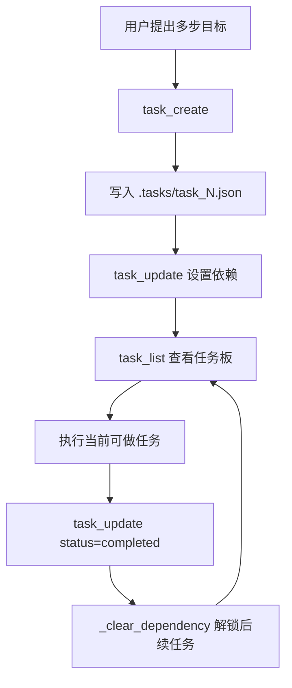

# 第 7 课：任务系统（Task System）

## 2. 这一课要解决什么问题

`s03` 的 todo 已经能表达“接下来做什么”，但它还是一个会话内的扁平清单。

如果没有这一课的机制，agent 会卡在几个地方：

- todo 只活在内存里，程序重启或上下文压缩后就没了
- 任务之间没有依赖关系，表达不了“先做 A，才能做 B”
- 不知道哪些任务能并行，哪些任务被阻塞
- 团队协作时，没有一个对话之外可共享的任务板

所以这一课真正要解决的是：任务状态必须脱离对话，变成可持久化、可依赖分析的外部控制面。

## 3. 这一课新增了什么能力

相对上一课，这一课新增的是一个基于磁盘文件的任务系统：

- `TaskManager`
- `.tasks/task_<id>.json`
- `task_create`
- `task_update`
- `task_get`
- `task_list`

同时新增了两个关键字段：

- `blockedBy`
- `blocks`

这让任务不再只是一个列表，而开始有依赖图的味道。

## 4. 核心实现思路（必须通俗、易懂）

这一课最重要的设计动作，是把“任务状态”从 `messages[]` 里搬到了文件系统。

也就是说，从这课开始：

- 对话负责推理
- `.tasks/` 负责保存任务真相

为什么这一步必须做？

因为到了 `s06`，上下文已经可以被压缩和重建。既然对话历史会被主动改写，那么真正关键的任务状态就不能继续只放在对话里。

这其实是在把：

- 会话内临时记忆
- 会话外持久状态

明确分层。

`TaskManager` 做的事情并不复杂，但非常工程化：

1. 每个任务一个 JSON 文件
2. 每个任务有稳定 ID
3. 状态有限，只允许 `pending / in_progress / completed`
4. 完成一个任务时，会自动清理其他任务对它的依赖

源码里最关键的一步不是 `create()`，而是 `update()` 在处理依赖关系时维护了双向一致性，并在完成任务时调用 `_clear_dependency()` 解锁后续任务。

## 5. 关键执行流程（最好有步骤图/伪流程）

### 运行时步骤

1. 模型调用 `task_create` 创建任务
2. `TaskManager` 在 `.tasks/` 下生成 `task_<id>.json`
3. 模型调用 `task_update` 为任务补充状态或依赖关系
4. 如果给某任务 `addBlocks=[2,3]`，系统会同步把 `2` 和 `3` 的 `blockedBy` 回写上当前任务 ID
5. 当某任务被标记为 `completed` 时，`_clear_dependency()` 会遍历其他任务，把它从 `blockedBy` 列表中移除
6. 模型随时可以调用 `task_list` / `task_get` 查看当前任务板

### Mermaid 流程图



## 6. 源码中的关键实现细节

### 关键类 / 关键函数 / 关键数据结构

- `TASKS_DIR = WORKDIR / ".tasks"`
- `class TaskManager`
- `TaskManager._max_id()`
- `TaskManager._load()`
- `TaskManager._save()`
- `TaskManager.create()`
- `TaskManager.update()`
- `TaskManager._clear_dependency()`
- `TaskManager.list_all()`
- `TASKS = TaskManager(TASKS_DIR)`

### 代码里到底怎么做的

#### 1. 单任务单文件，是最简单的持久化策略

任务文件格式大致是：

```json
{
  "id": 1,
  "subject": "实现接口",
  "description": "",
  "status": "pending",
  "blockedBy": [],
  "blocks": [],
  "owner": ""
}
```

这种设计很朴素，但教学价值很高：

- 容易看
- 容易手动排查
- 容易被别的机制复用

#### 2. `_max_id()` 用现有文件推导下一个任务 ID

初始化时扫描 `task_*.json`，取最大值再加一。这样即使进程重启，也不会把任务编号重置掉。

这也是“状态在磁盘而不在内存”最直接的体现。

#### 3. `update()` 里维护双向依赖

如果对任务 1 调用：

```python
add_blocks=[2]
```

不仅任务 1 的 `blocks` 会增加 2，任务 2 的 `blockedBy` 也会同步增加 1。

这一点很重要，因为之后无论从“我阻塞谁”还是“我被谁阻塞”两个角度看，任务图都能自洽。

#### 4. 完成任务时，会自动清理依赖

当 `status == "completed"` 时：

```python
self._clear_dependency(task_id)
```

`_clear_dependency()` 会遍历所有任务文件，把这个已完成任务从别人的 `blockedBy` 里去掉。

这一步的意义是：

- 任务完成不是孤立事件
- 它会改变整个任务图上“谁现在可做”的状态

#### 5. `list_all()` 提供的是人和模型都能看懂的摘要视图

它把状态渲染成：

- `[ ]` pending
- `[>]` in_progress
- `[√]` completed

同时把 `blockedBy` 信息也带出来。这样模型可以先看一眼任务板，再决定接下来该操作哪个任务。

## 7. 一个最小执行示例

假设用户输入：

```text
把功能开发拆成三个任务：先设计 schema，再实现 API，最后补测试
```

一个可能过程是：

1. 模型调用：

```json
{"name": "task_create", "input": {"subject": "设计 schema"}}
{"name": "task_create", "input": {"subject": "实现 API"}}
{"name": "task_create", "input": {"subject": "补测试"}}
```

2. `.tasks/` 下生成：

- `task_1.json`
- `task_2.json`
- `task_3.json`

3. 模型调用：

```json
{"name": "task_update", "input": {"task_id": 1, "addBlocks": [2]}}
{"name": "task_update", "input": {"task_id": 2, "addBlocks": [3]}}
```

4. 此时任务图变成：

```text
1 -> 2 -> 3
```

5. 当任务 1 完成，模型调用：

```json
{"name": "task_update", "input": {"task_id": 1, "status": "completed"}}
```

6. `_clear_dependency(1)` 会把任务 2 的 `blockedBy` 里的 `1` 去掉
7. 任务 2 变成可执行

这里最关键的状态变化不是“任务 1 完成了”，而是“任务 2 被自动解锁了”。

## 8. 这一课相对上一课的升级点

### 上一课做不到什么

`s06` 虽然解决了会话历史膨胀问题，但也把另一个问题暴露得更彻底：

- 如果历史会被压缩，那任务状态还放在历史里就不可靠

### 这一课怎么补上

`s07` 的回答很直接：

- 把任务状态搬到 `.tasks/`
- 用 JSON 文件保存任务真实状态
- 用依赖字段表达先后关系

### 代码结构上新增了哪些模块或职责

- 新增 `TaskManager`
- 新增 `.tasks/` 持久化目录
- 新增任务 CRUD 工具
- 新增依赖关系清理逻辑

同时要明确一个源码事实：`s07` 并不是 `s06` 上下文压缩逻辑的严格超集。它是一个聚焦“任务板持久化”的教学切片，概念上承接了压缩带来的需要，但代码上把焦点放到了任务系统。

## 9. 这一课的局限与工程启发

### 局限

- 没有事务，多个写者同时更新可能冲突。
- 没有循环依赖检测。
- 文件遍历更新在任务很多时会变慢。
- `owner` 字段已经出现，但这一课还没真正用它做多 agent 协作。
- 没有专门的“ready task”查询接口，模型要靠 `task_list` 自己判断。

### 工程启发

- 一旦会话可压缩，关键状态就必须外置。
- 任务系统不需要一开始就上数据库，文件化状态已经足够说明控制平面的价值。
- 这一课是后面 `s08`、`s09`、`s12` 的骨架。后台执行、团队协作、worktree 绑定，最终都需要一个对话之外的共享状态面。

## 10. 一句话总结

这节课把“计划”从会话里的临时白板，升级成了一个能跨轮次、跨压缩、跨机制继续存在的任务控制平面。
