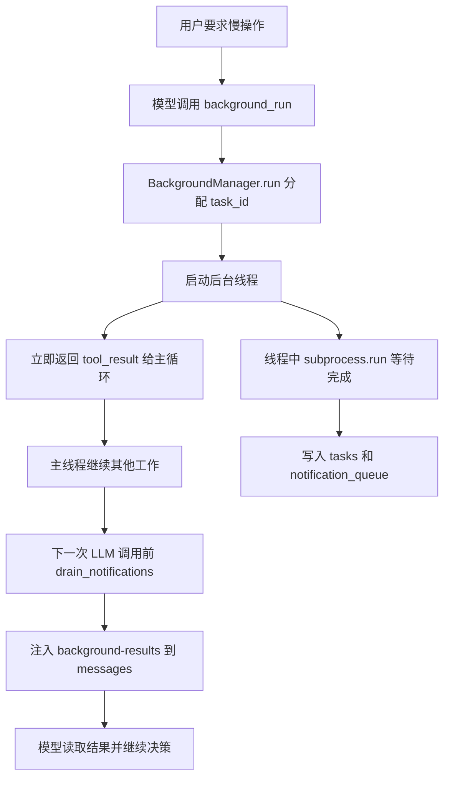

# 第 8 课：后台任务（Background Tasks）

## 2. 这一课要解决什么问题

这一课真正要解决的是：慢操作不能一直把主线程 agent 卡死。

在前面的实现里，工具调用基本都是阻塞式的。只要模型调用了一个耗时命令：

- `npm install`
- `pytest`
- `docker build`
- 一个很慢的脚本

主循环就只能等着。

如果没有这个机制，agent 会卡在几个地方：

- 主线程不能继续处理别的工具调用
- 模型不能在慢命令运行期间继续想下一步
- 用户要求“后台跑测试，同时我先改配置”时，系统做不到
- 长耗时命令会把整轮会话节奏拖成串行

一句话说：没有后台任务，agent 会把“等待”误当成“思考”的一部分。

## 3. 这一课新增了什么能力

相对上一课，这一课新增的是一套“后台执行 + 边界注入通知”的并发机制：

- `BackgroundManager`
- `background_run`
- `check_background`
- 后台线程执行
- 完成通知队列
- 在下一次 LLM 调用前统一注入后台结果

这节课新增的不是一个更快的 `bash`，而是把“等待子进程完成”这件事从主 agent loop 里拆了出去。

## 4. 核心实现思路（必须通俗、易懂）

这节课最值得讲清楚的，不是“用了线程”，而是“为什么通知是在下一次 LLM 调用前注入，而不是任意时刻打断模型”。

先看整个设计怎么分工：

### 主线程负责什么

- 跑 `agent_loop()`
- 调模型
- 执行普通工具
- 在每次调用模型之前，顺手检查后台任务有没有新结果

### 后台线程负责什么

- 真正等待慢命令跑完
- 收集 stdout/stderr
- 把结果写进任务表
- 再把一份精简通知推入队列

### 通知队列负责什么

- 把“后台线程什么时候完成”与“主线程什么时候把结果告诉模型”解耦

这其实是在把两件事拆开：

- 执行完成
- 模型可见

执行可以发生在任何时刻，但模型上下文的变更不能发生在任何时刻。

如果后台线程完成后立刻强行打断模型，会出几个问题：

- 主循环语义会变得不稳定
- 当前轮 assistant/tool_use 协议会被外部异步事件插断
- 上下文在半轮执行中被篡改，难以推理也难以调试

所以源码选择了一个更稳定的边界：

- 后台线程只负责把结果塞进队列
- 主线程只在“下一次调用 LLM 之前”排空队列并注入消息

这意味着：

- 模型上下文只在安全边界改变
- 主循环仍然是单线程语义
- 并发只发生在“等待 I/O”这一层

这里必须纠正一个常见误读：后台任务完成后的结果，并不是直接作为真正的 `tool_result` 回填给之前那个 `background_run`。源码真实做法是：

- 把结果包装成一段普通的 `user` 文本消息
- 放进 `<background-results> ... </background-results>`
- 再追加一条 `assistant` 确认消息 `"Noted background results."`

也就是说，它走的是“下一轮上下文注入”，不是“补发一个迟到的 tool_result”。

## 5. 关键执行流程（最好有步骤图/伪流程）

### 运行时步骤

1. 用户要求启动一个耗时命令。
2. 模型调用 `background_run(command)`。
3. `BackgroundManager.run()` 生成 `task_id`，把任务登记为 `running`。
4. harness 启动一个守护线程，目标函数是 `_execute(task_id, command)`。
5. `background_run` 立即返回，主线程继续本轮流程，不等待后台命令完成。
6. 后台线程调用 `subprocess.run(...)`，等待命令结束。
7. 命令结束后，线程把完整结果写回 `self.tasks[task_id]`。
8. 线程再在锁保护下，把精简通知追加到 `_notification_queue`。
9. 主线程下一次进入 `agent_loop()` 顶部时，调用 `BG.drain_notifications()`。
10. 如果队列里有结果，就把它们打包成：

```text
<background-results>
[bg:task_id] completed: ...
</background-results>
```

11. 然后作为新的 `user` 消息写进 `messages`，再补一条 `assistant` 确认消息。
12. 接下来才发起新的 LLM 调用。
13. 模型在这个边界点第一次“看见”后台任务结果，并决定后续动作。

### Mermaid 流程图



### 一段更接近源码的伪流程

```text
background_run(command)
  -> tasks[task_id] = running
  -> start thread(_execute)
  -> return "Background task <id> started"

_execute(task_id, command)
  -> subprocess.run(...)
  -> tasks[task_id] = completed/error/timeout
  -> lock(queue)
  -> queue.append(notification)

agent_loop()
  -> notifs = BG.drain_notifications()
  -> if notifs:
       messages += user("<background-results>...</background-results>")
       messages += assistant("Noted background results.")
  -> call LLM
```

## 6. 源码中的关键实现细节

### 关键类 / 关键函数 / 关键字段 / 数据结构

- `class BackgroundManager`
- `self.tasks`
- `self._notification_queue`
- `self._lock`
- `BackgroundManager.run()`
- `BackgroundManager._execute()`
- `BackgroundManager.check()`
- `BackgroundManager.drain_notifications()`
- `BG = BackgroundManager()`
- `TOOL_HANDLERS["background_run"]`
- `TOOL_HANDLERS["check_background"]`
- `agent_loop(messages)`

### 代码里到底怎么做的

#### 1. `self.tasks` 和 `_notification_queue` 是两种不同状态

`self.tasks` 存的是后台任务的全量状态：

- `status`
- `result`
- `command`

而 `_notification_queue` 存的是“刚刚完成、还没告诉模型”的精简通知。

这两个结构不要混：

- `tasks` 是查询面，给 `check_background()` 用
- `queue` 是推送面，给主循环下一轮注入用

#### 2. `run()` 只负责登记和启动，不负责等待

`BackgroundManager.run()` 做三件事：

1. 生成一个短 `task_id`
2. 往 `self.tasks` 里登记 `running`
3. 启动守护线程

它之所以能“后台化”，关键就在于它不会等 `_execute()` 跑完。

#### 3. `_execute()` 在线程里等待 `subprocess.run()`

真正阻塞等待的是：

```python
subprocess.run(..., timeout=300)
```

这一步放在线程里，主线程就不用等。

同时它会区分几种完成状态：

- `completed`
- `timeout`
- `error`

然后把完整结果写回：

```python
self.tasks[task_id]["status"] = status
self.tasks[task_id]["result"] = ...
```

#### 4. 锁保护的是队列，不是整个管理器

源码里：

```python
self._lock = threading.Lock()
```

它只在这两处使用：

- 线程完成后 `append` 通知
- 主线程 `drain_notifications()` 时复制并清空队列

也就是说，这把锁主要解决的是“队列并发读写安全”。

它没有完整保护 `self.tasks` 字典的所有读写。教学版之所以还能跑，是因为这个例子规模小、竞争窗口有限。做成生产版时，这会是你首先要补强的地方之一。

#### 5. 注入时机被固定在 `agent_loop()` 顶部

源码最关键的调用链就在这里：

```python
notifs = BG.drain_notifications()
if notifs and messages:
    messages.append({"role": "user", "content": f"<background-results>..."})
    messages.append({"role": "assistant", "content": "Noted background results."})
response = client.messages.create(...)
```

这里有三个值得特别注意的点：

- 只有在下一次模型调用之前才注入
- 注入的是普通 `user` 文本消息，不是补发 `tool_result`
- 还补了一条 `assistant` 确认消息，保持对话轨迹语义完整

这一步非常像一个“异步事件归并器”：

- 后台完成事件先排队
- 在主循环边界统一结算

#### 6. 通知内容故意是精简版

队列里的 `result` 被截断到了 `500` 字符：

```python
"result": (output or "(no output)")[:500]
```

但 `check_background(task_id)` 查询时可以返回更完整的结果。

这其实是另一层上下文治理：

- 主动推送只放摘要
- 真想看细节，再显式查询

## 7. 一个最小执行示例

假设用户输入：

```text
后台运行 "sleep 5 && echo done"，同时帮我创建一个 notes.txt
```

一个典型过程是：

1. 模型先调用：

```json
{"name": "background_run", "input": {"command": "sleep 5 && echo done"}}
```

2. `BackgroundManager.run()`：

- 生成 `task_id`，例如 `a1b2c3d4`
- `tasks[a1b2c3d4] = {"status": "running", ...}`
- 启动后台线程
- 立即返回：

```text
Background task a1b2c3d4 started: sleep 5 && echo done
```

3. 模型拿到这个结果后，还可以继续调用：

```json
{"name": "write_file", "input": {"path": "notes.txt", "content": "started"}}
```

4. 主线程本轮没有被 `sleep 5` 堵住，文件已经写完
5. 五秒后，后台线程结束，把：

```text
done
```

写进 `tasks[a1b2c3d4]["result"]`，并把精简通知推入队列
6. 下一次主线程准备调用 LLM时，`drain_notifications()` 取出通知
7. `messages` 新增：

```text
<background-results>
[bg:a1b2c3d4] completed: done
</background-results>
```

8. 模型这时才在上下文里正式看见后台任务完成，于是可以决定：

- 更新文件
- 汇报用户
- 或继续下一步动作

这个例子最能说明设计动机：后台线程解决的是等待，主循环边界注入解决的是上下文一致性。

## 8. 这一课相对上一课的升级点

### 上一课做不到什么

`s07` 已经有任务板，但所有工具调用还是前台串行执行。只要一个命令慢下来，整个 agent 就停住。

### 这一课怎么补上

`s08` 的补法不是“让任务系统更复杂”，而是引入独立的后台执行通道：

- 慢命令在线程里跑
- 主循环继续前进
- 结果在下一次 LLM 调用前统一回流

### 代码结构上新增了哪些模块或职责

- 新增 `BackgroundManager`
- 新增后台任务登记表
- 新增通知队列和锁
- `agent_loop()` 顶部新增后台结果注入逻辑

同时必须明确一个源码事实：`s08_background_tasks.py` 并没有继续保留 `s07` 的 `TaskManager`。概念上它承接了“系统状态和调度”的需求，但代码上它是一个专门聚焦并发执行边界的教学切片。

## 9. 这一课的局限与工程启发

### 局限

- 后台任务状态不持久化，进程退出就丢。
- 没有取消、重试、优先级等机制。
- `self.tasks` 没有做完整并发保护。
- 后台通知只靠下一次 LLM 调用前注入，如果主循环长期不再调用模型，结果就不会被看见。
- 与 `s07` 的任务板还没有真正打通。

### 工程启发

- 并发设计里最重要的常常不是“怎么起线程”，而是“什么时候把异步结果暴露给主状态机”。
- 结果在边界点注入，是保持主循环稳定性和可调试性的关键。
- 这节课为后面的多 agent 团队铺路：先学会后台并发命令，再引入后台并发模型代理。

## 10. 一句话总结

这节课把“等待慢命令完成”从 agent 的思考主线里剥离了出去，让主循环继续前进，而结果只在安全边界回流进模型上下文。
