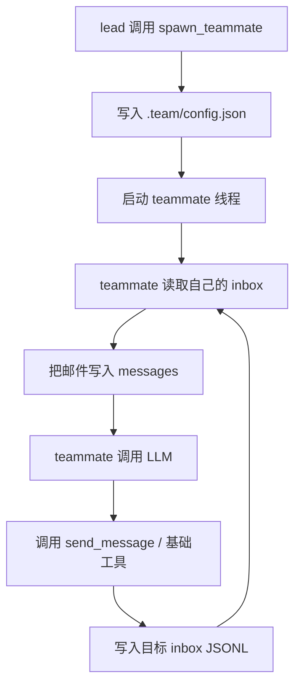

# 第 9 课：智能体团队（Agent Teams）

## 2. 这一课要解决什么问题

`s04` 的 subagent 已经能拆子任务，但它是一次性的：

- 生出来
- 干一轮
- 返回摘要
- 立刻消失

`s08` 的后台任务虽然能并发，但后台线程只会跑 shell 命令，不会自己做 LLM 推理。

如果没有这一课的机制，系统会卡在这里：

- 一个子任务完成后，那个执行者没有身份和后续上下文
- agent 之间不能持续通信
- 无法形成“长期存在的队友”
- 协作只能退化成“主线程临时派一个一次性 worker”

所以这一课真正要解决的是：让多个模型代理成为长期存在、可通信、可反复工作的团队成员。

## 3. 这一课新增了什么能力

相对上一课，这一课新增了：

- `MessageBus`
- `.team/config.json`
- `.team/inbox/*.jsonl`
- `TeammateManager`
- `spawn_teammate`
- `send_message`
- `read_inbox`
- `broadcast`

最关键的新能力是：队友不是一次性函数调用，而是有名字、有状态、能再次被唤醒的长期线程。

## 4. 核心实现思路（必须通俗、易懂）

这一课的设计思想是：把 subagent 从“临时调用”升级成“持久角色”。

它有三个核心部件：

### 1. 成员注册表

保存在 `.team/config.json` 里，记录：

- 队友名字
- 角色
- 状态

### 2. 邮箱系统

每个队友一个 JSONL inbox，例如：

- `.team/inbox/alice.jsonl`
- `.team/inbox/bob.jsonl`
- `.team/inbox/lead.jsonl`

发送消息就是 append，读消息就是 read + drain。

### 3. 每个队友自己的 agent loop

每个队友在独立线程里运行自己的 LLM 循环：

- 先读 inbox
- 把邮件作为 `user` 内容塞进自己的 `messages`
- 再调用模型
- 需要时继续发消息或用工具

这其实是在把“多 agent 协作”翻译成一个非常具体的工程结构：

- 配置文件保存身份
- inbox 文件保存异步消息
- 每个线程保存独立上下文

源码里最关键的一步不是 `spawn_teammate()` 本身，而是 `_teammate_loop()` 把“读邮箱 -> 写进 messages -> 调模型 -> 继续工作”这条链跑起来了。

## 5. 关键执行流程（最好有步骤图/伪流程）

### 运行时步骤

1. lead 模型调用 `spawn_teammate(name, role, prompt)`
2. `TeammateManager.spawn()` 把成员写入 `.team/config.json`
3. 启动一个后台线程执行 `_teammate_loop(name, role, prompt)`
4. 队友线程创建自己的 `messages = [{"role": "user", "content": prompt}]`
5. 每轮开始先 `BUS.read_inbox(name)`
6. 把 inbox 中的 JSON 消息逐条转成 `user` 内容追加到自己的 `messages`
7. 调模型，让队友决定下一步
8. 队友可以调用基础工具，也可以调用 `send_message`
9. 邮件被写入对方 inbox 文件
10. 对方在自己的下一轮读取 inbox 时看到消息并继续工作

### Mermaid 流程图



## 6. 源码中的关键实现细节

### 关键类 / 关键函数 / 关键数据结构

- `TEAM_DIR = WORKDIR / ".team"`
- `INBOX_DIR = TEAM_DIR / "inbox"`
- `VALID_MSG_TYPES`
- `class MessageBus`
- `MessageBus.send()`
- `MessageBus.read_inbox()`
- `MessageBus.broadcast()`
- `class TeammateManager`
- `TeammateManager.spawn()`
- `TeammateManager._teammate_loop()`
- `TeammateManager._exec()`
- `TeammateManager._teammate_tools()`
- `TEAM = TeammateManager(TEAM_DIR)`

### 代码里到底怎么做的

#### 1. inbox 是 append-only JSONL 文件

`MessageBus.send()` 会构造：

```json
{
  "type": "message",
  "from": "lead",
  "content": "...",
  "timestamp": 1234567890
}
```

然后把它追加到：

```python
inbox_path = self.dir / f"{to}.jsonl"
```

这种做法非常简单，但足够说明异步消息传递的原理。

#### 2. `read_inbox()` 是“读完即清空”

`MessageBus.read_inbox(name)` 做的是：

1. 读完整个 inbox 文件
2. 逐行 JSON 反序列化
3. 读完后 `write_text("")` 清空文件

这意味着 inbox 的语义不是历史归档，而是“待处理消息队列”。

#### 3. 队友状态会持久化到 config 文件

`TeammateManager.spawn()` 里：

- 如果成员已存在且状态允许复用，就更新状态
- 否则新增成员条目

状态可能包括：

- `working`
- `idle`
- `shutdown`

这让队友不只是一个线程对象，也是一份可被系统查询的角色记录。

#### 4. 队友线程是一个真正独立的 agent loop

`_teammate_loop()` 里最值得注意的点有几个：

- 队友有自己的 `sys_prompt`
- 队友有自己的 `messages`
- 队友每轮先读 inbox
- 队友能用的工具集由 `_teammate_tools()` 单独定义

这说明从 `s09` 开始，系统里真的有多个“各自持有上下文的模型代理”同时存在。

#### 5. `VALID_MSG_TYPES` 已经提前声明了后续协议类型

虽然 `s09` 主要用的是普通消息和广播，但源码里已经声明了：

- `shutdown_request`
- `shutdown_response`
- `plan_approval_response`

这非常像一个教学上的伏笔：消息总线先搭起来，后面 `s10` 再在这条总线上引入协议化握手。

## 7. 一个最小执行示例

假设用户输入：

```text
创建一个叫 alice 的队友，让她检查测试目录里有哪些测试文件，并把结果发给你
```

一个可能的调用链是：

1. lead 模型调用：

```json
{
  "name": "spawn_teammate",
  "input": {
    "name": "alice",
    "role": "tester",
    "prompt": "Inspect the test directory and send me a short summary."
  }
}
```

2. `TeammateManager.spawn()`：

- 在 `.team/config.json` 记录 `alice`
- 启动 `alice` 的线程

3. `alice` 线程进入 `_teammate_loop()`
4. 她可能调用 `bash`、`read_file`
5. 最后调用：

```json
{
  "name": "send_message",
  "input": {
    "to": "lead",
    "content": "I found 12 test files under tests/..."
  }
}
```

6. `lead.jsonl` inbox 被追加一条消息
7. lead 主循环下一次开始时读取 inbox，把消息注入 `<inbox>...</inbox>`
8. lead 模型看到队友回复，再继续决策

这里最重要的变化是：`alice` 不会像 subagent 一样执行完就死掉。她变成了一个长期存在的队友。

## 8. 这一课相对上一课的升级点

### 上一课做不到什么

`s08` 的后台线程能并发，但只是并发 shell。它不会自己思考，也不会和主线程持续通信。

### 这一课怎么补上

`s09` 把“并发执行者”升级成了“并发模型代理”：

- 每个队友都有自己的 LLM 循环
- 每个队友都有自己的 inbox
- lead 和队友之间可以持续发消息

### 代码结构上新增了哪些模块或职责

- 新增 `MessageBus`
- 新增 `TeammateManager`
- 新增 `.team/config.json`
- 新增 `.team/inbox/*.jsonl`
- lead 主循环顶部新增 inbox 注入逻辑

同时要明确一个源码事实：`s09` 并没有把 `s08` 的 `BackgroundManager` 带过来。概念上它从“并发命令”迈向“并发 agent”，但代码上是一个新的协作切片。

## 9. 这一课的局限与工程启发

### 局限

- inbox 读写没有更强的文件锁与原子性保障。
- 队友线程都在同一进程里，进程挂了全没。
- 没有消息确认、重试、超时处理。
- 队友仍共享同一工作目录，后面会发生目录冲突问题。
- 上下文增长仍然需要别的机制治理。

### 工程启发

- 多 agent 协作并不一定要从复杂调度器开始，先有“身份 + 邮箱 + 独立循环”就能工作。
- 线程只是承载体，真正重要的是“每个队友拥有独立消息历史和通信协议入口”。
- 这节课为 `s10` 铺路：有了邮箱之后，才谈得上协议和握手。

## 10. 一句话总结

这节课把一次性的子代理，升级成了有身份、有状态、能通过邮箱持续协作的长期队友。
