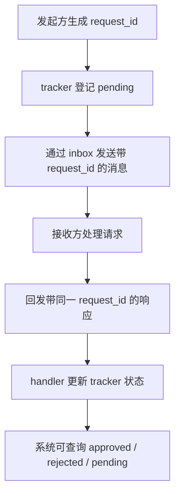

# 第 10 课：团队协议（Team Protocols）

## 2. 这一课要解决什么问题

到了 `s09`，队友之间已经能发消息，但“能发消息”不等于“能稳定协作”。

如果没有这节课的机制，团队会卡在这些地方：

- 让一个队友关机，结果不知道它是否看到了请求
- 队友提交计划后，lead 不知道怎么正式批准或拒绝
- 一来一回的消息混在 inbox 里，分不清哪条是在回应哪件事
- 状态只能靠人类或模型自己揣测，没有可查询的协议状态

所以这一课真正要解决的是：非结构化消息必须升级成带关联 ID 的协议化协商。

## 3. 这一课新增了什么能力

相对上一课，这一课新增了两个协议，以及一套共同的关联模式：

- shutdown 协议
- plan approval 协议
- 基于 `request_id` 的 tracker

关键新增组件是：

- `shutdown_requests`
- `plan_requests`
- `_tracker_lock`
- `handle_shutdown_request()`
- `handle_plan_review()`
- `_check_shutdown_status()`

真正的新能力不是“多了几个消息类型”，而是团队交互第一次进入“请求-响应 + 状态跟踪”的阶段。

## 4. 核心实现思路（必须通俗、易懂）

这节课的设计思想很清楚：不同协作场景都复用同一个协议骨架。

这个骨架是：

1. 发起方生成一个 `request_id`
2. 在全局 tracker 里登记为 `pending`
3. 发消息时把 `request_id` 带上
4. 响应方回消息时也带上同一个 `request_id`
5. 某个 handler 根据 `request_id` 更新 tracker 状态

换句话说，这节课真正新增的不是“关机”和“审批”这两个业务场景，而是“任何跨 agent 协商都可以套同一套 request-response 模式”。

这也正是为什么 README 里会把这一课概括成：

```text
one request-response pattern drives all negotiation
```

不过这里必须非常严格地以源码为准，指出教学实现里的一个简化：

- 源码里没有单独的 `plan_approval_request` 消息类型
- 队友提交计划时，复用了 `plan_approval_response` 这个消息类型把计划发给 lead

也就是说，这里协议概念是清楚的，但消息命名并不完美。这是教学实现，不是生产级协议设计。

## 5. 关键执行流程（最好有步骤图/伪流程）

### 运行时步骤：Shutdown 协议

1. lead 调用 `shutdown_request(teammate)`
2. `handle_shutdown_request()` 生成 `request_id`
3. `shutdown_requests[request_id] = {"target": teammate, "status": "pending"}`
4. lead 通过 `BUS.send(..., "shutdown_request", {"request_id": ...})` 发消息
5. 队友在自己的 `_teammate_loop()` 中读到 inbox
6. 队友可调用 `shutdown_response(request_id, approve, reason)`
7. handler 更新 `shutdown_requests[request_id]["status"]`
8. 同时向 `lead` inbox 发送 `shutdown_response`
9. 如果批准，队友线程设置 `should_exit = True` 并退出

### 运行时步骤：Plan Approval 协议

1. 队友调用 `plan_approval(plan_text)`
2. `_exec()` 中生成新的 `request_id`
3. `plan_requests[request_id] = {"from": sender, "plan": plan_text, "status": "pending"}`
4. 队友把计划通过邮箱发送给 lead
5. lead 从 inbox 看见计划
6. lead 调用自己的 `plan_approval(request_id, approve, feedback)`
7. `handle_plan_review()` 更新 tracker 状态
8. 审批结果再通过邮箱回给原队友

### Mermaid 流程图



## 6. 源码中的关键实现细节

### 关键类 / 关键函数 / 关键字段 / 数据结构

- `shutdown_requests = {}`
- `plan_requests = {}`
- `_tracker_lock = threading.Lock()`
- `VALID_MSG_TYPES`
- `handle_shutdown_request(teammate)`
- `handle_plan_review(request_id, approve, feedback)`
- `_check_shutdown_status(request_id)`
- `TeammateManager._exec()`
- `TOOL_HANDLERS` 中 lead 侧的协议工具

### 代码里到底怎么做的

#### 1. tracker 是全局字典，不是消息的一部分

这很关键。邮箱只负责传递请求和响应，真正的“协议状态”保存在进程内 tracker：

- `shutdown_requests`
- `plan_requests`

这让系统不必每次都去 inbox 全量回放历史来推断当前状态。

#### 2. `_tracker_lock` 保护的是 tracker 更新

既然 lead 和队友可能在不同线程里同时更新 tracker，就需要：

```python
with _tracker_lock:
    ...
```

这说明到了 `s10`，并发不再只是后台 shell 的并发，而是“多个模型代理同时读写共享协商状态”的并发。

#### 3. teammate 侧工具名和 lead 侧工具名有“视角差”

这里必须点破一个容易看迷糊的地方。

在队友侧：

- `shutdown_response` 是“真正发响应”
- `plan_approval` 是“提交计划，请求审批”

在 lead 侧：

- `shutdown_response` 实际上是“查询 shutdown 请求状态”
- `plan_approval` 实际上是“审批某个计划请求”

也就是说，同一个工具名在不同角色上承担的职责并不完全对称。

这不是最优 API 设计，但很符合教学代码的写法：尽量少加概念，先把 request-response 模式讲明白。

#### 4. `plan_approval_response` 被复用成“计划提交流”

这是这一课最值得明确写进讲义的源码事实：

```python
BUS.send(
    sender, "lead", plan_text, "plan_approval_response",
    {"request_id": req_id, "plan": plan_text},
)
```

也就是说：

- 队友提交计划时，并没有单独的 `plan_approval_request`
- 它直接用 `plan_approval_response` 这个消息类型把计划送给 lead

从教学角度，这说明了 request_id 模式已经足够解释原理；但从协议设计角度，这个命名是简化过的。

#### 5. shutdown 在这一课仍然依赖模型合作

在 `s10` 的 `_teammate_loop()` 中：

- 队友收到 `shutdown_request`
- 是否同意关闭，还是交给模型决定，要通过 `shutdown_response` 工具表达
- 如果批准，`should_exit = True`

也就是说，这一课的关机协议是“协商式”的，不是强制 kill。

## 7. 一个最小执行示例

假设 lead 生成了一个叫 `alice` 的队友。`alice` 先提交一份计划，之后 lead 再请求她优雅关闭。

### 计划审批流程

1. `alice` 调用：

```json
{"name": "plan_approval", "input": {"plan": "1. read tests 2. patch parser 3. rerun"}}
```

2. `_exec()` 生成 `request_id = "ab12cd34"`，写入：

```python
plan_requests["ab12cd34"] = {
    "from": "alice",
    "plan": "...",
    "status": "pending"
}
```

3. lead 的 inbox 收到一条带 `request_id` 的消息
4. lead 调用：

```json
{
  "name": "plan_approval",
  "input": {
    "request_id": "ab12cd34",
    "approve": true,
    "feedback": "Proceed"
  }
}
```

5. tracker 状态变成 `approved`
6. `alice` 下一轮读取 inbox，看到审批结果

### 关机流程

1. lead 调用：

```json
{"name": "shutdown_request", "input": {"teammate": "alice"}}
```

2. `handle_shutdown_request()` 生成新的 `request_id`
3. `shutdown_requests[request_id] = pending`
4. `alice` 收到请求后调用 `shutdown_response(..., approve=true)`
5. tracker 状态更新为 `approved`
6. `alice` 线程退出

这个例子里，最重要的不是消息内容，而是所有状态都能通过 `request_id` 被关联起来。

## 8. 这一课相对上一课的升级点

### 上一课做不到什么

`s09` 的邮箱能传消息，但不保证协商可追踪：

- 哪条回复对应哪条请求，不清楚
- 请求到底在 pending 还是 approved，也不清楚

### 这一课怎么补上

`s10` 给协作消息加上了协议骨架：

- `request_id`
- tracker
- 响应更新状态

### 代码结构上新增了哪些模块或职责

- 新增两个全局 tracker
- 新增锁保护 tracker
- 新增 shutdown handler
- 新增 plan review handler
- teammate 工具集新增协议工具

相对上一课，最大的变化不是多了几个消息类型，而是“系统第一次有了可追踪的协商状态机”。

## 9. 这一课的局限与工程启发

### 局限

- tracker 只在内存里，进程重启后状态丢失。
- `plan_approval_response` 兼做请求，命名不够严谨。
- lead 和 teammate 工具名存在角色视角混用。
- 没有统一的超时、重试、取消机制。
- 协议仍然建立在文件 inbox 上，没有更强的消息总线保证。

### 工程启发

- 多 agent 协作真正难的不是“能通信”，而是“通信能否被关联和追踪”。
- `request_id` 是最小但非常通用的协议基元。
- 这节课为 `s11` 做了重要铺垫：当队友开始自治找活时，仍然需要这种可追踪的协商模式来处理计划和治理动作。

## 10. 一句话总结

这节课把“队友之间互发消息”升级成了“带 request_id、可查询状态、可复用到多个场景的正式协商协议”。
