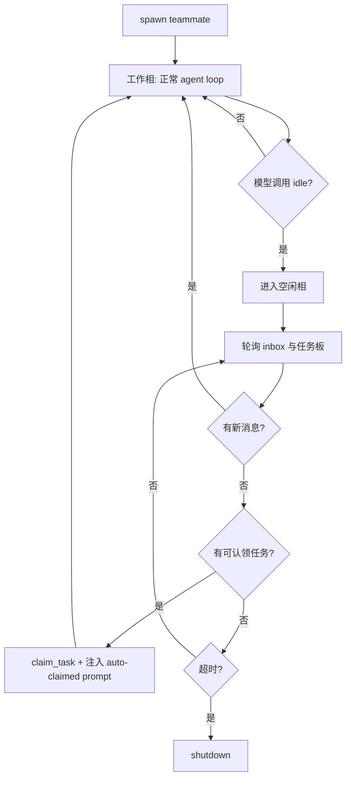

# 第 11 课：自治智能体（Autonomous Agents）

## 2. 这一课要解决什么问题

到了 `s10`，lead 已经能和队友发消息、做审批、发关机请求，但协作仍然是强中心化的。

如果没有这一课的机制，团队会卡在这里：

- lead 必须给每个队友单独发 prompt
- 任务板上明明有活，但队友闲着也不会自己去认领
- 队友做完当前任务后就停住，不能进入待命状态再找下一份工作
- 随着队友数量增加，lead 会被人工分派拖垮

所以这一课真正要解决的是：让队友从“被动等待指派”变成“会自己找活的自治执行者”。

## 3. 这一课新增了什么能力

相对上一课，这一课新增了三组能力：

- 空闲相与工作相双阶段生命周期
- 自动扫描 `.tasks/` 任务板并认领任务
- 身份重注入 `make_identity_block()`

新增的关键组件包括：

- `POLL_INTERVAL`
- `IDLE_TIMEOUT`
- `scan_unclaimed_tasks()`
- `claim_task()`
- `_claim_lock`
- `make_identity_block()`
- `idle` 工具
- `claim_task` 工具

## 4. 核心实现思路（必须通俗、易懂）

这一课最大的变化不是多了一个任务工具，而是队友线程的生命周期变了。

在 `s09-s10` 中，队友线程的逻辑更像：

```text
收到任务 -> 干活 -> 结束/空闲
```

而到了 `s11`，变成了两个阶段循环：

### 工作相（WORK PHASE）

- 正常跑 agent loop
- 处理 inbox
- 调工具
- 如果模型调用 `idle`，说明当前活做完了，进入空闲相

### 空闲相（IDLE PHASE）

- 每隔 `POLL_INTERVAL` 秒轮询一次
- 先看 inbox 有没有新消息
- 再看任务板有没有未认领且未被阻塞的任务
- 如果有，就自己认领并恢复工作相
- 如果 `IDLE_TIMEOUT` 到了还没事做，就自己关机

这其实是在把一个“只会执行 prompt 的线程”，改造成一个“会在任务市场里待命、接活、继续干”的自治代理。

源码里最关键的一步不是 `scan_unclaimed_tasks()`，而是 `TeammateManager._loop()` 里“工作相 -> 空闲相 -> 自动恢复”的双相结构。

## 5. 关键执行流程（最好有步骤图/伪流程）

### 运行时步骤

1. lead 生成一个自治队友线程
2. 队友先进入工作相
3. 工作相里正常跑 LLM + 工具循环
4. 模型调用 `idle`，表示自己当前没活了
5. 队友状态改成 `idle`
6. 进入空闲相，开始轮询：
   - 先读 inbox
   - 再扫描 `.tasks/`
7. 如果 inbox 里有新消息，就把消息写入 `messages`，恢复工作相
8. 如果发现未认领任务：
   - 调 `claim_task()`
   - 把 `<auto-claimed>...</auto-claimed>` 任务提示写入 `messages`
   - 状态改回 `working`
   - 恢复工作相
9. 如果超过 `IDLE_TIMEOUT` 还没有工作，就把状态改成 `shutdown` 并退出线程

### Mermaid 流程图



## 6. 源码中的关键实现细节

### 关键类 / 关键函数 / 关键字段 / 数据结构

- `POLL_INTERVAL = 5`
- `IDLE_TIMEOUT = 60`
- `_claim_lock = threading.Lock()`
- `scan_unclaimed_tasks()`
- `claim_task(task_id, owner)`
- `make_identity_block(name, role, team_name)`
- `TeammateManager._set_status()`
- `TeammateManager._loop()`
- `_teammate_tools()` 里的 `idle`、`claim_task`

### 代码里到底怎么做的

#### 1. 自动认领是直接读 `.tasks/` 文件，不是复用 `s07` 的 `TaskManager`

这点必须明确写出来。

`scan_unclaimed_tasks()` 直接：

- 遍历 `TASKS_DIR.glob("task_*.json")`
- 反序列化每个文件
- 选出：
  - `status == "pending"`
  - `owner` 为空
  - `blockedBy` 为空

也就是说，`s11` 虽然概念上建立在任务板之上，但源码并没有把 `s07` 的 `TaskManager` 整体搬进来，而是只复用了 `.tasks/` 这个状态面。

#### 2. `claim_task()` 用 `_claim_lock` 做了最小认领互斥

```python
with _claim_lock:
    ...
    task["owner"] = owner
    task["status"] = "in_progress"
```

这把锁解决的是“同一进程里多个线程同时抢同一任务”的基本问题。

它还不是完整分布式锁，但教学上已经足够说明：自治认领一定要考虑抢占冲突。

#### 3. `idle` 工具不是休眠命令，而是生命周期切换信号

当模型调用 `idle` 时，handler 并不做复杂工作，只返回：

```text
Entering idle phase. Will poll for new tasks.
```

真正重要的是 `idle_requested = True` 这个标志会让工作相跳出，进入空闲相。

这说明 `idle` 的本质不是“工具动作”，而是“线程状态切换指令”。

#### 4. `make_identity_block()` 是身份重注入

这个函数返回：

```python
{
  "role": "user",
  "content": "<identity>You are 'name', role: role, team: team_name...</identity>"
}
```

它解决的不是任务逻辑，而是“长时间空闲、上下文被压缩或变短之后，队友可能忘了自己是谁”这个问题。

不过源码里也有个值得特别指出的事实：

- `s11` 文件本身没有实现 `s06` 的压缩逻辑
- 它只是通过 `len(messages) <= 3` 这个启发式条件，在自动认领任务前补一段身份块

所以这里是“概念上承接了压缩问题”，但代码上没有完整接回 `s06` 的压缩系统。

#### 5. shutdown 行为相对 `s10` 有教学上的简化

这点必须以源码为准纠正。

在 `s11` 的 `_loop()` 里，队友如果在 inbox 里看到：

```python
msg.get("type") == "shutdown_request"
```

它会直接：

- `self._set_status(name, "shutdown")`
- `return`

也就是说，它并没有像 `s10` 那样一定走完整的 `shutdown_response` 协商链路。虽然工具集里仍然保留了 `shutdown_response`，但实际自动行为已经更偏“直接退出”了。

这是教学切片之间一个很值得指出的源码差异。

## 7. 一个最小执行示例

假设任务板里有一个文件：

```json
{
  "id": 3,
  "subject": "补充登录接口测试",
  "status": "pending",
  "owner": "",
  "blockedBy": []
}
```

同时队友 `bob` 当前没有工作，已经调用过 `idle`。

接下来会发生：

1. `bob` 进入空闲相
2. 每 5 秒执行一次轮询
3. 没有新 inbox 消息，于是执行 `scan_unclaimed_tasks()`
4. 发现任务 3 满足：
   - `pending`
   - 无 owner
   - 无 blockedBy
5. 调用 `claim_task(3, "bob")`
6. `task_3.json` 被改成：

```json
{
  "id": 3,
  "subject": "补充登录接口测试",
  "status": "in_progress",
  "owner": "bob",
  "blockedBy": []
}
```

7. 如果当前 `messages` 很短，还会插入一段 `<identity>...</identity>`
8. 再向 `messages` 追加：

```text
<auto-claimed>Task #3: 补充登录接口测试</auto-claimed>
```

9. 状态切回 `working`
10. `bob` 恢复工作相，开始真正处理任务

这个例子里最关键的变化是：没有 lead 明确下发 prompt，队友自己发现并认领了工作。

## 8. 这一课相对上一课的升级点

### 上一课做不到什么

`s10` 的团队已经有协议，但仍然靠 lead 主动分配任务。队友是被动执行者。

### 这一课怎么补上

`s11` 把队友升级成自治执行者：

- 允许进入 `idle`
- 在空闲时主动扫任务板
- 自动认领合适任务
- 长时间无事可做时自动退出

### 代码结构上新增了哪些模块或职责

- 队友线程从单相循环变成“工作相 + 空闲相”双相循环
- 新增任务扫描与认领逻辑
- 新增身份重注入逻辑
- 新增 `idle`、`claim_task` 工具

相对上一课，这一课最大的变化不是多了一个类，而是队友线程从“被调用一次干一次”变成“自己维护生命周期并主动找事做”。

## 9. 这一课的局限与工程启发

### 局限

- 任务选择策略非常简单，始终拿第一个可认领任务。
- 只在单进程内用 `_claim_lock`，跨进程不安全。
- shutdown 路径和 `s10` 协商协议并不完全一致。
- 身份重注入只是启发式，不是真正的压缩恢复协议。
- 没有把任务优先级、角色匹配度、工作负载均衡做进去。

### 工程启发

- 自治不等于复杂规划，先让队友能“空闲时找活”已经是巨大升级。
- 生命周期设计比单次工具设计更关键。真正改变系统行为的，是工作相与空闲相的切换。
- 这节课直接为 `s12` 铺路：既然多个队友会主动认领并执行任务，下一步就必须解决共享目录冲突。

## 10. 一句话总结

这节课让队友从“等命令的人”变成了“会自己看任务板、认领任务并恢复工作的自治执行者”。
