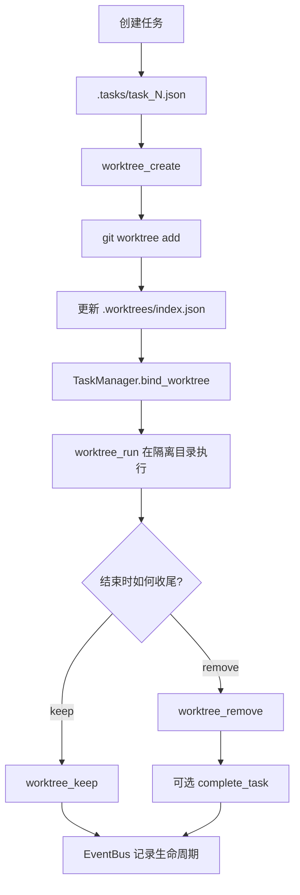

# 第 12 课：Worktree 与任务隔离（Worktree Task Isolation）

## 2. 这一课要解决什么问题

到了 `s11`，系统已经能让多个队友自主认领任务，但还有一个非常现实的工程问题：大家还是共用同一个目录。

如果没有这一课的机制，系统会卡在这些地方：

- 两个任务同时改同一个仓库工作目录，未提交改动互相污染
- 一个任务想回滚，另一个任务的改动也被卷进去
- 很难把“任务状态”和“实际执行目录”明确绑定
- 并行执行一多，文件树就变成共享战场

所以这一课真正要解决的是：任务只是控制平面，真正执行必须有隔离的目录通道。

## 3. 这一课新增了什么能力

相对上一课，这一课新增的是一套“任务板 + worktree 生命周期 + 事件流”的执行隔离机制：

- `detect_repo_root()`
- `EventBus`
- 增强版 `TaskManager`，带 `worktree` 绑定
- `WorktreeManager`
- `worktree_create`
- `worktree_run`
- `worktree_status`
- `worktree_keep`
- `worktree_remove`
- `worktree_events`

最关键的新能力是：一个任务可以被绑定到一个独立 git worktree 目录里执行。

## 4. 核心实现思路（必须通俗、易懂）

这一课最重要的设计不是“多了个 git 命令”，而是明确把系统拆成了两个平面。

### 控制平面：任务板

位于 `.tasks/`，回答的问题是：

- 要做什么任务
- 当前任务状态是什么
- 谁在做
- 绑定了哪个 worktree

### 执行平面：worktree 目录

位于 `.worktrees/` 及 git worktree 目录，回答的问题是：

- 在哪个隔离目录里执行
- 对应哪个分支
- 当前 worktree 处于 `active / kept / removed` 哪种生命周期状态

### 可观测性平面：事件流

位于 `.worktrees/events.jsonl`，记录：

- 创建前后
- 删除前后
- keep
- task 完成
- 失败事件

这其实是在把“做什么”和“在哪做”彻底解耦：

- task 管目标
- worktree 管目录
- event bus 管生命周期可见性

源码里最关键的一步不是 `git worktree add` 本身，而是 `WorktreeManager.create()` 在创建成功后同时更新了：

- `.worktrees/index.json`
- 任务文件中的 `worktree` 字段
- 生命周期事件流

这意味着 worktree 不是临时命令结果，而是正式进入系统状态面。

这里还必须明确一个源码事实：`s12` 不是“把 s11 的自治团队完整迁移到 worktree”。源码里已经没有 team mailbox 和 autonomous loop 了。它更像一个专门聚焦“任务控制平面 + worktree 执行平面”的独立教学切片。

## 5. 关键执行流程（最好有步骤图/伪流程）

### 运行时步骤

1. 程序启动时用 `detect_repo_root()` 探测 git 仓库根目录
2. 初始化：
   - `TASKS = TaskManager(REPO_ROOT / ".tasks")`
   - `EVENTS = EventBus(REPO_ROOT / ".worktrees" / "events.jsonl")`
   - `WORKTREES = WorktreeManager(REPO_ROOT, TASKS, EVENTS)`
3. 模型调用 `task_create` 创建任务
4. 模型调用 `worktree_create(name, task_id)` 创建 worktree
5. `WorktreeManager.create()`：
   - 校验名字
   - 记录 `worktree.create.before`
   - 执行 `git worktree add -b wt/<name> ...`
   - 更新 `.worktrees/index.json`
   - 调 `TaskManager.bind_worktree(task_id, name)`
   - 记录 `worktree.create.after`
6. 模型调用 `worktree_run(name, command)` 在隔离目录中执行命令
7. 任务结束时：
   - 要保留目录：`worktree_keep(name)`
   - 要拆除并完成任务：`worktree_remove(name, complete_task=True)`
8. `worktree_remove()` 会：
   - 执行 `git worktree remove`
   - 视情况把绑定任务设为 `completed`
   - 把 worktree 从 `active` 改成 `removed`
   - 发出生命周期事件

### Mermaid 流程图



## 6. 源码中的关键实现细节

### 关键类 / 关键函数 / 关键字段 / 数据结构

- `detect_repo_root(cwd)`
- `REPO_ROOT`
- `class EventBus`
- `EventBus.emit()`
- `EventBus.list_recent()`
- `class TaskManager`
- `TaskManager.bind_worktree()`
- `TaskManager.unbind_worktree()`
- `class WorktreeManager`
- `WorktreeManager._is_git_repo()`
- `WorktreeManager._run_git()`
- `WorktreeManager._validate_name()`
- `WorktreeManager.create()`
- `WorktreeManager.run()`
- `WorktreeManager.remove()`
- `WorktreeManager.keep()`
- `.worktrees/index.json`
- `.worktrees/events.jsonl`

### 代码里到底怎么做的

#### 1. `detect_repo_root()` 先把“仓库根”找出来

它调用：

```python
git rev-parse --show-toplevel
```

这样 `s12` 不会误以当前 shell 所在目录就是仓库根，而是尽量把：

- `.tasks/`
- `.worktrees/`
- git worktree 操作

都锚定到真正的 repo root。

#### 2. `EventBus` 是 append-only 生命周期流

`EventBus.emit()` 会把事件写成一行 JSON：

```json
{
  "event": "worktree.create.after",
  "ts": 1234567890,
  "task": {...},
  "worktree": {...}
}
```

这不是完整的事件总线，但已经足够说明一个重要思想：

- 任务状态和目录状态变化，不应该只发生在内存里
- 还应该留下可以回看的生命周期记录

#### 3. `TaskManager` 新增了 `worktree` 字段

任务文件里除了 `status`、`owner`，现在还多了：

```json
"worktree": "auth-refactor"
```

这一步很关键，因为从现在开始任务知道“自己在哪条执行通道里跑”。

#### 4. `WorktreeManager.create()` 同时更新三处状态

创建成功后，它会：

1. 把新 worktree 记入 `.worktrees/index.json`
2. 调 `TaskManager.bind_worktree(task_id, name)`
3. 发出 `worktree.create.after` 事件

也就是说，它不是单纯跑一个 git 命令，而是在维护系统状态一致性。

#### 5. `bind_worktree()` 会把任务从 `pending` 推到 `in_progress`

如果任务原来是 `pending`，绑定 worktree 时会自动推进状态：

```python
if task["status"] == "pending":
    task["status"] = "in_progress"
```

这很合理，因为一旦给任务分配了执行目录，这通常意味着已经正式开工了。

#### 6. `worktree_run()` 真正实现了目录级隔离

关键点只有一个，但非常重要：

```python
subprocess.run(..., cwd=path)
```

这里的 `path` 不再是主工作区，而是对应的 worktree 目录。

这意味着不同任务的 shell 命令可以在不同目录树里执行，互不污染未提交改动。

#### 7. `remove()` 是收尾编排，不只是删除目录

`WorktreeManager.remove()` 除了跑：

```python
git worktree remove
```

还会根据 `complete_task=True`：

- 把绑定任务标为 `completed`
- `unbind_worktree()`
- 发出 `task.completed`
- 把 index 中该 worktree 状态改为 `removed`

也就是说，“移除 worktree”已经是一个生命周期动作，而不是裸命令。

#### 8. `keep()` 和 `remove()` 体现了显式 closeout 选择

很多教学代码只讲创建，不讲收尾。这里源码特意补了两条 closeout 路径：

- `keep()`
  保留 worktree 目录和记录
- `remove()`
  拆除执行通道，并可同步完结任务

这一步非常像真实系统里的资源收尾策略。

## 7. 一个最小执行示例

假设用户想并行做一个“认证重构”任务。

### 第一步：创建任务

模型调用：

```json
{"name": "task_create", "input": {"subject": "Implement auth refactor"}}
```

系统生成：

```json
{
  "id": 1,
  "subject": "Implement auth refactor",
  "status": "pending",
  "worktree": ""
}
```

### 第二步：创建并绑定 worktree

模型调用：

```json
{"name": "worktree_create", "input": {"name": "auth-refactor", "task_id": 1}}
```

系统会：

1. 执行：

```text
git worktree add -b wt/auth-refactor .worktrees/auth-refactor HEAD
```

2. 在 `.worktrees/index.json` 增加：

```json
{
  "name": "auth-refactor",
  "path": ".../.worktrees/auth-refactor",
  "branch": "wt/auth-refactor",
  "task_id": 1,
  "status": "active"
}
```

3. 同时把 `task_1.json` 改成：

```json
{
  "id": 1,
  "status": "in_progress",
  "worktree": "auth-refactor"
}
```

### 第三步：在隔离目录里运行命令

模型调用：

```json
{"name": "worktree_run", "input": {"name": "auth-refactor", "command": "git status --short"}}
```

命令的 `cwd` 指向 `.../.worktrees/auth-refactor`

### 第四步：收尾

如果任务完成且不想保留目录：

```json
{
  "name": "worktree_remove",
  "input": {
    "name": "auth-refactor",
    "complete_task": true
  }
}
```

这会：

- 移除 worktree
- 把任务标记完成
- 清空任务的 `worktree` 绑定
- 在事件流里留下记录

这个例子说明：从这一课开始，任务执行终于有了真正隔离的工作通道。

## 8. 这一课相对上一课的升级点

### 上一课做不到什么

`s11` 里的队友已经会自己找活，但一旦多个任务并行改仓库，所有人还在同一个目录里打架。

### 这一课怎么补上

`s12` 的补法是把“控制”和“执行”拆开：

- 任务板继续负责目标状态
- worktree 负责目录级隔离
- event bus 负责生命周期可见性

### 代码结构上新增了哪些模块或职责

- 新增 `EventBus`
- `TaskManager` 增加 worktree 绑定能力
- 新增 `WorktreeManager`
- 新增 `.worktrees/index.json`
- 新增 `.worktrees/events.jsonl`
- 新增 create/run/keep/remove/status/events 一整组 worktree 工具

同时必须明确一个源码事实：`s12` 不是把 `s11` 的自治 agent 团队完整接入 worktree，而是改成了一个专门讲“任务控制平面 + worktree 执行平面”的教学切片。

## 9. 这一课的局限与工程启发

### 局限

- 必须运行在 git 仓库里，否则 worktree 工具会报错。
- index 和 tasks 更新没有更强事务保证。
- 没有自动 merge、rebase、cleanup 流程。
- 事件流只是 append-only 记录，没有更完整的订阅或恢复机制。
- 还没有和 `s11` 的自治队友做真正的 per-agent worktree 绑定整合。

### 工程启发

- 多任务并行时，状态隔离和目录隔离是两回事，必须分别建模。
- 任务板适合做控制平面，worktree 适合做执行平面。
- 一旦进入真实并行改码场景，目录隔离往往比 prompt 优化更关键。

## 10. 一句话总结

这节课把“多个任务同时干活”从共享目录里的混战，升级成了“任务有控制面、worktree 有执行面、事件流能回看生命周期”的真正隔离执行系统。
